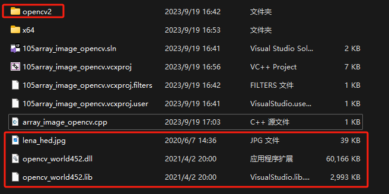

# 一、内存与指针

# 1.指针基础

## 1.1 需理解的问题

>- 指针指向的内存位置、大小、类型
>- 指针申请新的内存和指向已有的内存
>- 怎么获取变量的地址指针变量自己存储在哪里
>- 指向的内存地址是实际的地址吗?
>- 如何释放内存
>- 指针可以直接理解为内存地址
>- 32 为程序和64 位程序对指针的影响
>- 间接符号根据地址访问其值
>- & 取地址
>- 带着疑问来看 , 先写代码指针地址指针变量

## 1.2 代码实验

[[参考代码]](https://github.com/WONGZEONJYU/cpp_memory_pool_note/tree/main/code/101pointer)

>```c++
>#include <iostream>
>
>using namespace std;
>
>int main(int argc, char* argv[])
>{
>      cout << "101 pointer\n";
>      /*p1存在栈中*/
>      /*p1指向的空间在堆中*/
>      int* p1 { new int };
>      /* *间接符号,间接访问*/
>      *p1 = 101;
>      int i {10};
>      cout << "i = " << i << '\n';
>      int* p2 { &i };
>      *p2 = 102;
>      cout << "i = " << i << '\n';
>      cout << "p1 = " << p1 << '\n';
>
>      cout << "sizeof(p1) = " << sizeof(p1) << '\n';
>      cout << "sizeof(*p1) = " << sizeof(*p1) << '\n';
>      delete p1;
>
>      cout << "after delete p1 = " << p1 << '\n';
>
>      if (p1) {
>          cout << "p1 not empty?\n";
>      }
>      p1 = nullptr; // nullptr c++11 NULL 0
>      delete p1;
>      if (!p1) {
>          cout << "p1 is empty!\n";
>      }
>      //delete p1;
>
>	_CRT_UNUSED(getchar());
>	return 0;
>}
>
>```
>
>

# 2. 程序的内存地址划分

## 2.1 简化划分

>
>
>保留区 c库 0地址开始
>代码区 `.text`
>全局变量区 `.data` 未初始化 `.bss `
>堆区
>栈区
>命令行参数、环境变量
>内核区 windows 2g linux 1g
>
>

## 2.2 实验

[[参考代码]](https://github.com/WONGZEONJYU/cpp_memory_pool_note/tree/main/code/102memory_address)

>```c++
>#include <iostream>
>
>using namespace std;
>
>int g1, g2{ 0 }, g3{ 1 },g4{ 2 }; 
>static int sg1{ 3 };
>
>int main(int argc, char* argv[])
>{
>    static int s1{ 5 };
>    cout << "memory address! cppds.com" <<     
>            "\ncode area main() = " << main << /* 代码区 .text */
>            "\nglobal_Uninitialized &g1 = " << &g1 <<
>            "\nglobal_initialized to 0 &g2 = " << &g2 << 
>            "\nglobal_initialized to 1 &g3 = " << &g3 << 
>            "\nglobal_initialized to 2 &g4 = " << &g4 << 
>            "\nstatic global_initialized to 3 &sg1 = " << &sg1 << 
>            "\nstatic local_initialized to 5 &s1 = " << &s1 << '\n';
>
>    int* p1{ new int }, *p2{ new int };
>
>    cout << "Heap space address p1 = " << p1 << 
>            "\nHeap space address p2 = " << p2 << 
>            "\nThe stack space address of the pointer variable &p1 = " << &p1 << 
>            "\nThe stack space address of the pointer variable &p2 = " << &p2 << '\n';
>
>    int i1{ 100 };
>    int i2{ 101 };
>
>    cout << "stack space address &i1 = " << &i1 << 
>            "\nstack space address &i2 = " << &i2 << '\n';
>
>    delete p1,delete p2;
>    p1 = p2 = nullptr;
>    (void)getchar();
>	return 0;
>}
>```

### 2.2.1 windows x86

>

### 2.2.2 windows x64

>

### 2.3.3 linux x64

>

# 3. 数组的堆栈空间初始化和 c++11 的 for 遍历

## 3.1 一维数组

>数组是具有一定顺序关系的若干相同类型变量的集合体
>
>

## 3.2 实验

[[参考代码]](https://github.com/WONGZEONJYU/cpp_memory_pool_note/tree/main/code/103ptr_array)

>```c++
>class XData
>{
>public:
>    int x = 0;
>    int y = 0;
>};
>
>static void One_dimensional()
>{
>    int arr1[10];
>    memset(arr1, 0, sizeof(arr1));
>    int arr2[5]{ 1,2,3,4,5 };
>    int arr3[32]{ 1,2,3 };
>    int arr4[1024]{  };
>    int arr5[]{ 1,2,3,4 };
>    char str1[]{ "test001" };
>
>    cout << "sizeof(arr5) = " << sizeof(arr5) <<
>        "\nsizeof(str1) = " << sizeof(str1) << '\n';
>
>    for (auto s : str1) {
>        cout << s << "-" << flush;
>    }
>
>    cout << "\n&arr2[0] = " << &arr2[0] <<
>        "\n&arr2[1] = " << &arr2[1] <<
>        "\narr2+2 = " << arr2 + 2 << '\n';
>
>    (void)std::find(std::begin(arr5), std::end(arr5), 3);
>    /*查找数值`3`在数组的那个位置,函数返回元素的地址*/
>
>    int* parr1{ new int[1024] };
>    int psize{ 2048 };
>    auto parr2{ new unsigned char[psize] };
>
>    memset(parr2, 0, psize);
>    auto parr3{ new int[psize] };
>    memset(parr3, 0, psize * sizeof(int));
>
>    int* parr4{ new int[3] { 1, 2, 3 } };
>    int* parr5{ new int[] { 1,2,3,6 } };
>    int* parr6{ new int[] { 0 } };
>
>    cout << "parr5[2] = " << parr5[2] <<
>        "\n*(parr5+3) = " << *(parr5 + 3) <<
>        "\n&parr5[0] = " << &parr5[0] <<
>        "\n&parr5[1] = " << &parr5[1] <<
>        "\nparr5+2 = " << parr5 + 2 << '\n';
>
>    delete[] parr1;
>    parr1 = nullptr;
>    delete[] parr2;
>    parr2 = nullptr;
>    delete[] parr3;
>    parr3 = nullptr;
>    delete[] parr4;
>    parr4 = nullptr;
>    delete[] parr5;
>    parr5 = nullptr;
>    delete[] parr6;
>    parr6 = nullptr;
>    XData* datas = new XData[1024];
>    delete[] datas;
>    datas = nullptr;
>    /*释放动态数组的时候,delete必须加上[],否则容易引起一些奇怪的问题*/
>}
>```
>
>

# 4. 二维数组的初始化和遍历

## 4.1 栈区的二维数组

>

## 4.2 实验

[[参考代码]](https://github.com/WONGZEONJYU/cpp_memory_pool_note/tree/main/code/103ptr_array)

>```c++
>#define ARRSIZE 3
>
>static void multidimensional()
>{
>  // 2x3
>// 1 2 3
>// 4 5 6
>
>      unsigned char arr1[2][ARRSIZE]  { {1,2,3},{4,5,6} };
>      unsigned char arr2[][ARRSIZE]  {
>          {1,2,3},
>          {2,3,4},
>          {3,4,5} 
>      };
>
>      cout << "arr1[2][3] sizeof(arr1) = " << sizeof(arr1) << '\n';
>      cout << "arr2[][3] sizeof(arr2) = " << sizeof(arr2) << '\n';
>
>      int arr3[2][3][4] {
>          {{1,2,3,4},{2,3,4,5},{1,2,3,4}},
>          {{1,2,3,4},{2,3,4,5},{1,2,3,4}},
>      };
>
>      int arr4[][3][4] {
>          {{1,2,3,4},{2,3,4,5},{1,2,3,4}},
>          {{1,2,3,4},{2,3,4,5},{1,2,3,4}},
>          {{1,2,3,4},{2,3,4,5},{1,2,3,4}},
>      };
>
>      for (auto arr : arr2) {
>          for (int i{}; i < ARRSIZE; i++) {
>              cout << static_cast<int>(arr[i]) << " " << flush;
>          }
>          cout << '\n';
>      }
>
>      int width{ ARRSIZE };
>      int height { sizeof(arr2) / (ARRSIZE * sizeof(unsigned char)) };
>
>      for (int i{}; i < height; i++) {
>
>          for (int j {}; j < width; j++) {
>              arr2[i][j]++;
>              cout << (int)arr2[i][j] << "-" << flush;
>          }
>          cout << '\n';
>      }
>}
>```
>
>

## 4.2 堆区二维数组

>

## 4.3 实验

[[参考代码]](https://github.com/WONGZEONJYU/cpp_memory_pool_note/tree/main/code/103ptr_array)

>```c++
>    /*堆中的二维数组的两种创建方式*/
>    {
>        /*连续空间*/
>        int size{ 2 };
>        int(*arr5)[3] {new int[size][3]{ {1,1,2},{3,2,3} }};
>        for (int i {}; i  < size; i ++) {
>            /*sizeof(parr5[i]) 可以获取第二维度的数组大小*/
>            for (auto& a : arr5[i]) {
>                cout << a << '=' << flush;
>            }
>            cout << '\n';
>        }
>        delete[] arr5;
>        arr5 = nullptr;
>        /*指针数组*/
>        /*
>            1 2 3 1
>            4 5 6 3
>            1 1 1 1
>        */
>
>        constexpr int width{ 4 }, height{ 3 };
>        int** arr6 { new int* [height] {} };
>        for (int i {}; i < height; i++){
>            arr6[i] = new int[width] {};
>        }
>
>        arr6[1][1] = 99;/*,修改第1行,第1列的元素为99(从0开始)*/
>
>        for (int i{}; i < height; ++i) {
>            for (int j{}; j < width; ++j) {
>                cout << arr6[i][j] << ' ';
>            }
>            cout << '\n';
>        }
>
>        for (int i{}; i < height; i++){
>            delete arr6[i];
>            arr6[i] = nullptr;
>        }
>
>        delete[] arr6;
>        arr6 = nullptr;
>    }
>```
>
>

# 5. 指针类型转换 

## 5.1先补充一下C++几个强制类型转换关键字知识

>- `static_cast<type>(variable)`
>   - 用于基本类型间的转换
>   - 不能用于基本类型指针间的转换 
>     - 例如: `char*` 转换 `int*` 不可以通过`static_cast`转换,编译期会报错
>   - 用于有 **继承关系类对象** 之间的转换和 **类指针** 之间的转换
>   - 可用于 `void*` 与 其他指针间的转换
>     - 例如 : (`void*` 转 `char*`)  或 (`int*` 转换 `void*` )
>- `const_cast<type>(variable)`
>   - 用于去除变量的只读/易变(`const/volatile`)属性
>   - 强制转换的目标类型必须是 **指针或引用**
>   - 用来将 `const/volatile` 类型转换为非 `const / volatile` 类型
>- `reinterpret_cast<type>(variable)`
>   - 用于指针类型间的强制转换
>   - 用于整数和指针类型间的强制转换
>- `dynamic_cast<Type>(variable)`
>   - 用于有继承关系的类指针间的转换
>   - 用于有交叉关系的类指针间的转换
>   - 具有类型检查的功能
>   - 需要虚函数支持
>

## 5.2 void 指针和指针类型转换实验

[[参考代码]](https://github.com/WONGZEONJYU/cpp_memory_pool_note/tree/main/code/104ptr_void_const)

>```c++
>struct Frame{
>    void* ctx;
>};
>
>static void _about_void_pointer()
>{
>    /*void 指针和指针类型转换*/
>    void* ptr1{ malloc(1024) };
>    free(ptr1);
>
>    int num{ 1 };
>    void* ptr{ &num };
>    int* ptr2{ static_cast<int*>(ptr) }; //void * 
>    int* ptr3{ (int*)ptr };    /*C风格,在cpp下不推荐使用*/
>    //static_cast 增加了一些验证
>    const int* cptr1{ new int[1024] };
>    volatile int* vptr1{ new int[1024] };
>
>    //int* ptr4 = static_cast<int*>(cptr1); /* static_cast无法去除 带const/volatile属性的变量 */
>    int* ptr4{ (int*)(cptr1) };    /*C风格,在cpp下不推荐使用*/
>    int* ptr6{ const_cast<int*>(cptr1) }; //去掉const
>    int* ptr8{ const_cast<int*>(vptr1) }; /*去掉volatile*/
>
>    unsigned char* ucptr{ new unsigned char[1024] };
>    //int* ptr5 = static_cast<int*>(ucptr);
>    auto ptr5{ (int*)ucptr }; /*C风格,在cpp下不推荐使用*/
>    auto ptr7{ reinterpret_cast<int*>(ucptr) }; /*替换指针类型*/
>
>    delete[]ucptr;
>    delete[]cptr1;
>    delete[]vptr1;
>    /*无论指针类型如何转变,不影响释放*/
>}
>```

## 5.3 常量指针和指针常量实验

[[参考代码]](https://github.com/WONGZEONJYU/cpp_memory_pool_note/tree/main/code/104ptr_void_const)

>```c++
>static void _about_const_pointer()
>{
>    /*常量指针和指针常量*/
>    const int i1{ 100 };
>    const int* pi1{ &i1 };/*指向常量的指针*/
>    // (*pi1)++; /*指向的值不能修改*/
>    int const* pi2{ &i1 }; /*同上*/
>    /*指针本身是常量 , 指向不能修改*/
>
>    int* const pi3{ new int };
>    //pi3++;
>    //pi3 = new int;
>    *pi3 = 200;
>    delete pi3;
>    const int* const pi4{ &i1 };    /*指向和值都不能修改*/
>/*
>    pi4 = new int;
>    *pi4 = 300;
>*/
>}
>```

# 6. 指针操作二维数组对opencv灰度图做反色

[[参考工程]]()

## 6.1相关配置

>
>
>
>
>

## 6.2 实验代码(通过二维数组修改图片灰度)

>```c++
>#include <iostream>
>#include <opencv2/opencv.hpp>
> 
>using namespace std;
>using namespace cv;
>
>int main(int argc, char* argv[])
>{
>	/*
>		400 x 400 的灰度图 做反色 黑色 ==> 白色 
>		一个字节unsigned char 表示灰度 
>		255 - 灰度 做反色
>	*/
>	
>	/*补0 用于4字节对齐
>		1 2 3 0
>		4 5 6 0
>		7 8 9 0
>		1 2 3 0 4 5 6 0 7 8 9 0
>	*/
>
>	auto img {imread("lena_hed.jpg",IMREAD_GRAYSCALE)};
>	const auto height{ img.rows }, width{ img.cols };
>	cout << "img.elemSize() = " << img.elemSize() << '\n';
>	imshow("test1", img);
>	/*通过指针访问连续的二维数组*/
>	for (int i{}; i < height; ++i) {
>
>		for (int j{}; j < width; ++j) {
>
>			const auto c{ img.data[i * width + j] };
>			img.data[i * width + j] = 255 - c;
>		}
>	}
>
>	imshow("test2",img);
>	waitKey(0);
>	(void)getchar();
>	return 0;
>}
>
>```
>
>
