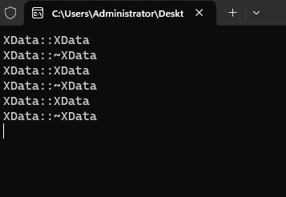
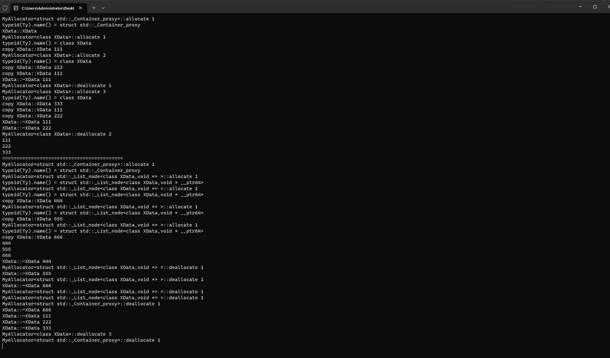

# 分配器allocator详解

# 1. 基础知识

>* 使用 allocator 将内存分配、对象构造分离开 修改空间申请到内存池 使用过程中 , 可以先分配内存 , 对象不
>  构造 , 使用时再构造  
>
>* 分配用于实现容器算法时 , 将其与储存细节隔离从而解耦合
>
>* 分配器提供存储分配与释放的标准方法
>
>* `STL` 实现了一个标准的分配器 `allocator`
>
>* 演示标准分配器使用 , c++17 需要 tailer 调用构造和析构

# 2. 实验一

[[参考代码]](/code/113allocator)

>```c++
>#include <iostream>
>
>using namespace std;
>
>class XData
>{
>public:
>	XData() { cout << __FUNCTION__ << "\n"; }
>	~XData() { cout << __FUNCTION__ << "\n"; }
>};
>
>namespace one
>{
>	void test()
>	{
>		allocator<XData> xdata_allco;
>		constexpr int size{ 3 };
>
>		/*分配对象空间 不调用构造*/
>		auto dataarr{ xdata_allco.allocate(size) };
>
>		for (size_t i{}; i < size; i++) {
>
>			/*allocator_traits 类模板提供访问分配器(Allocator)各种属性的标准化方式*/
>
>			/*调用构造*/
>			allocator_traits<decltype(xdata_allco)>::construct(xdata_allco, dataarr + i);
>
>			/*调用析构*/
>			allocator_traits<decltype(xdata_allco)>::destroy(xdata_allco, dataarr + i);
>		}
>
>		/*清理空间 , 不调用析构*/
>		xdata_allco.deallocate(dataarr, size);
>	}
>}
>
>
>int main(int argc, char* argv[])
>{
>
>	one::test();
>	(void)getchar();
>	return 0;
>}
>
>
>```

 

# 3. 自定义分配器

>* 可以演示内存共享 , 内存泄漏探测 , 预分配对象存储,内存池
>
>* 演示自定义vector和list分配器,并分析其源码

## 3.1 代码

[[参考代码]](/code/113allocator)

>```c++
>#ifndef MYALLOCATOR
>#define MYALLOCATOR
>
>template<typename Ty>
>class MyAllocator
>{
>public:
>	using value_type = Ty;
>
>	MyAllocator() {}
>
>	template<typename Other>
>	MyAllocator(const MyAllocator<Other>&) {}
>
>	void deallocate(Ty* const ptr,const size_t count)
>	{
>		std::cout << __FUNCTION__ << " " << count << "\n";
>		free(ptr);
>	}
>
>	Ty* allocate(const size_t count) {
>		std::cout << __FUNCTION__ << " " << count << "\n";
>		std::cout << "typeid(Ty).name() = " << typeid(Ty).name() << "\n";
>		return static_cast<Ty*>(malloc(count * sizeof(Ty)));
>	}
>};
>
>#endif
>
>```
>
>

>```c++
>#include <iostream>
>#include <vector>
>#include <list>
>#include "MyAllocator.hpp"
>
>class XData
>{
>public:
>	XData() { cout << __FUNCTION__ << "\n"; }
>	~XData() { cout << __FUNCTION__ << " " << index << "\n"; }
>	XData(const XData& o) {
>		index = o.index; 
>		cout << "copy " << __FUNCTION__ << " " << index << "\n";
>	}
>	int index{};
>};
>
>namespace two
>{
>	void test()
>	{
>		vector<XData, MyAllocator<XData>> vd;
>		XData d;
>		d.index = 111;
>		vd.push_back(d);
>		d.index = 222;
>		vd.push_back(d);
>		d.index = 333;
>		vd.push_back(d);
>
>		for (auto& xd :vd){
>			cout << xd.index << '\n';
>		}
>
>		cout << "==========================================\n";
>
>		list<XData, MyAllocator<XData>> datas;
>		d.index = 444;
>		datas.push_back(d);
>		d.index = 555;
>		datas.push_back(d);
>		d.index = 666;
>		datas.push_back(d);
>
>		for (auto& d:datas)
>		{
>			cout << d.index << '\n';
>		}
>	}
>}
>
>int main(int argc, char* argv[])
>{
>	two::test();
>	(void)getchar();
>	return 0;
>}
>```

 
