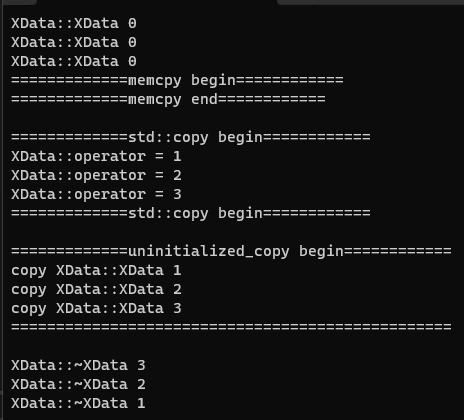

# 11-未初始化内存算法

# 1. 将范围内的对象复制到未初始化的内存区域

>* 将范围内的对象复制到未初始化的内存区域
>* 为什么不用 `memcpy` 或者 std::copy ? 
>* `uninitialized_copy` 会对对象进行复制 (拷贝构造)
>* 不复制如果内部有堆栈空间 , 将产生问题  

# 2. 实验

[[参考代码]](https://github.com/WONGZEONJYU/cpp_memory_pool_note/tree/main/code/114uninitialized_copy)

>```c++
>#include <iostream>
>#include <memory>
>
>using namespace std;
>/*
>将范围内的对象复制到未初始化的内存区域
>
>为什么不用 `memcpy` 或者 std::copy ?
>
>uninitialized_copy 会对对象进行复制 (拷贝构造)
>
>不复制如果内部有堆栈空间，将产生问题
>*/
>
>class XData
>{
>public:
>
>	XData() { cout << __FUNCTION__ << " " << index << "\n"; }
>
>	XData(const XData& o) {
>		index = o.index;
>		cout << "copy " << __FUNCTION__ << " " << index << "\n";
>		
>	}
>
>	XData& operator=(const XData& o) {
>
>		if (this != &o){
>			index = o.index;
>			cout << __FUNCTION__ << " " << index << "\n";
>		}
>
>		return *this;
>	}
>
>	~XData() { cout << __FUNCTION__ << " " << index << "\n"; }
>
>	int index{};
>};
>
>int main(int argc, char* argv[])
>{
>	XData xdatas[3];
>	xdatas[0].index = 1;
>	xdatas[1].index = 2;
>	xdatas[2].index = 3;
>	uint8_t buf[1024]{};
>	cout << "=============memcpy============\n";
>	//memcpy(buf, xdatas, sizeof(xdatas));
>	cout << "=============std::copy============\n";
>	std::copy(std::begin(xdatas), std::end(xdatas), reinterpret_cast<XData*>(buf));
>	/*call operator=(...)*/
>	cout << "=============uninitialized_copy begin============\n";
>	uninitialized_copy(std::begin(xdatas), std::end(xdatas), reinterpret_cast<XData*>(buf));
>	/*call copy construct*/
>	cout << "=================================================\n";
>
>	(void)getchar();
>	return 0;
>}
>
>```

 
