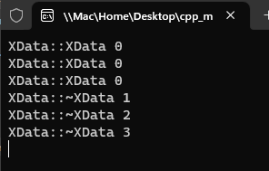

# 12- `construct_at destroy` 对象构造和销毁

# 1.需要c++17 版本以上支持,详情看代码

>[[c++参考链接]](https://zh.cppreference.com/w/%E9%A6%96%E9%A1%B5)
>
>建议用 vs2019 以上版本

# 2.实验

[[参考代码]]()

>```c++
>#include <iostream>
>#include <memory>
>#include <xutility>
>
>using namespace std;
>
>class XData
>{
>public:
>
>	XData() { cout << __FUNCTION__ << " " << index << "\n"; }
>
>	XData(const XData& o) {
>		index = o.index;
>		cout << "copy " << __FUNCTION__ << " " << index << "\n";
>
>	}
>
>	XData& operator=(const XData& o) {
>
>		if (this != &o) {
>			index = o.index;
>			cout << __FUNCTION__ << " " << index << "\n";
>		}
>
>		return *this;
>	}
>
>	~XData() { cout << __FUNCTION__ << " " << index << "\n"; }
>
>	int index{};
>};
>
>
>int main(int argc,char* argv[])
>{
>	constexpr int size{ 3 };
>	auto data{ static_cast<XData*>(malloc(size * sizeof(XData))) };
>
>	for (int i {}; i < size; i++) {
>
>		if (data) {
>			/*c++20 construct*/
>			std::construct_at(&data[i]);
>			data[i].index = i + 1;
>		}
>	}
>	/*c++17 call destroy*/
>	destroy(data, data + size);
>	free(data);
>	data = nullptr;
>    (void)getchar();
>    return 0;
>}
>
>
>```
>
>