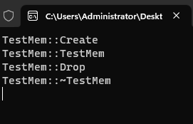

# 13-限制栈中创建对象 , 限制调用 delete 销毁对象  

# 1. 实验

[[参考代码]](https://github.com/WONGZEONJYU/cpp_memory_pool_note/tree/main/code/116_class_mem)

>```c++
>#include <iostream>
>using namespace std;
>
>/*
>指针与面向对象
>限制栈中创建对象 , 限制调用 delete 销毁对象
>
>*/
>
>class TestMem
>{
>public:
>	static TestMem* Create() {
>		cout << __FUNCTION__ << "\n";
>		return new TestMem();
>	}
>
>	static void Drop(TestMem* tm) { /*destroy*/
>		cout << __FUNCTION__ << "\n";
>		delete tm;
>	}
>
>protected:
>	TestMem() {
>		cout << __FUNCTION__ << "\n";
>	}
>	virtual ~TestMem() {
>		cout << __FUNCTION__ << "\n";
>	}
>};
>
>int main(int argc, char* argv[])
>{
>	//TestMem tm1;
>	//auto tm2{ new TestMem() };
>
>	TestMem* tm3{ TestMem::Create() };
>
>	//delete tm3;
>
>	TestMem::Drop(tm3);
>
>	(void)getchar();
>	return 0;
>}
>
>```
>
>