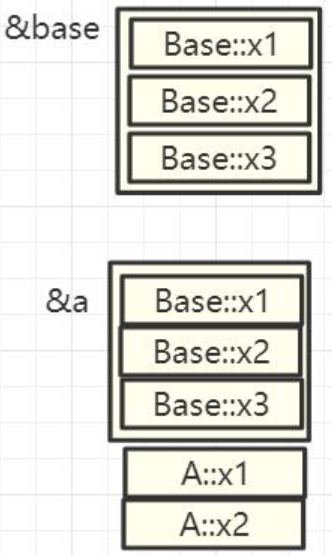
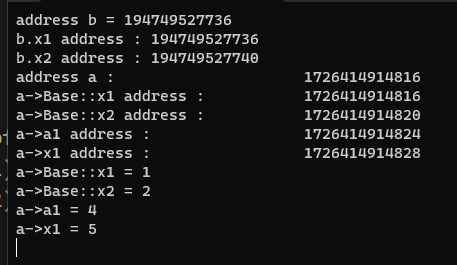
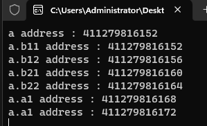

# 14-继承的内存指针分析

# 1. 实验一 : 单一继承

>

[[参考代码]]()

>```c++
>#include <iostream>
>using namespace std;
>
>class Base
>{
>public:
>	int x1{1}, x2{2};
>};
>
>class A : public Base
>{
>public:
>	int a1{ 4 }, x1{ 5 };
>
>};
>
>int main(int argc, char* argv[])
>{
>#if 1
>	/*单继承的内存指针分析*/
>	{
>		Base b;
>		cout << "address b = " << reinterpret_cast<long long>(addressof(b)) << "\n";
>		cout << "b.x1 address : " << reinterpret_cast<long long>(&b.x1) << "\n";
>		cout << "b.x2 address : " << reinterpret_cast<long long>(&b.x2) << "\n";
>
>		A* a { new A() };
>		cout << "address a : \t\t\t" << reinterpret_cast<long long>(a) << "\n";
>		cout << "a->Base::x1 address : \t\t" << reinterpret_cast<long long>(&a->Base::x1) << "\n";
>		cout << "a->Base::x2 address : \t\t" << reinterpret_cast<long long>(&a->Base::x2) << "\n";
>
>		cout << "a->a1 address : \t\t" << reinterpret_cast<long long>(&a->a1) << "\n";
>		cout << "a->x1 address : \t\t" << reinterpret_cast<long long>(&a->x1) << "\n";
>
>		cout << "a->Base::x1 = " << a->Base::x1 << "\n";
>		cout << "a->Base::x2 = " << a->Base::x2 << "\n";
>		cout << "a->a1 = " << a->a1 << "\n";
>		cout << "a->x1 = " << a->x1 << "\n";
>
>		delete a;
>	}
>#endif
>    
>    (void)getchar();
>	return 0;
>}
>```
>
>

# 2. 实验二 : 多继承

[[参考代码]]()

>```c++
>#include <iostream>
>using namespace std;
>
>class Base1
>{
>public:
>	int b11{ 1 }, b12{ 2 };
>
>};
>
>class Base2
>{
>public:
>	int b21{ 1 }, b22{ 2 };
>
>};
>
>/* Base1 ==> Base2 ==> A2 地址顺序从左到右 */
>
>class A2 :public Base1, public Base2
>{
>public:
>	int a1{ 5 }, a2{ 6 };
>};
>
>int main(int argc, char* argv[])
>{
>#if 1
>	{
>		/*多继承内存分析*/
>		A2 a;
>		cout << "a address : " << reinterpret_cast<long long>(&a) << "\n";
>		cout << "a.b11 address : " << reinterpret_cast<long long>(&a.b11) << "\n";
>		cout << "a.b12 address : " << reinterpret_cast<long long>(&a.b12) << "\n";
>		cout << "a.b21 address : " << reinterpret_cast<long long>(&a.b21) << "\n";
>		cout << "a.b22 address : " << reinterpret_cast<long long>(&a.b22) << "\n";
>		cout << "a.a1 address : " << reinterpret_cast<long long>(&a.a1) << "\n";
>		cout << "a.a1 address : " << reinterpret_cast<long long>(&a.a2) << "\n";
>	}
>#endif
>
>	(void)getchar();
>	return 0;
>}
>```
>
>

# 3. 实验三 : 多继承的二义性内存分析

[[参考代码]]()

>```c++
>
>```
>
>