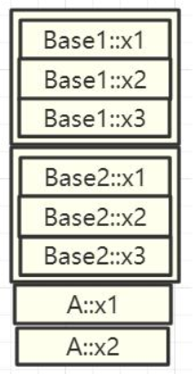
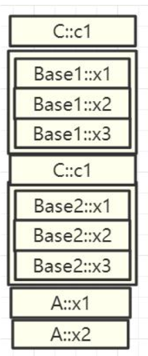
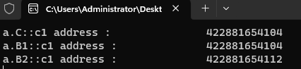
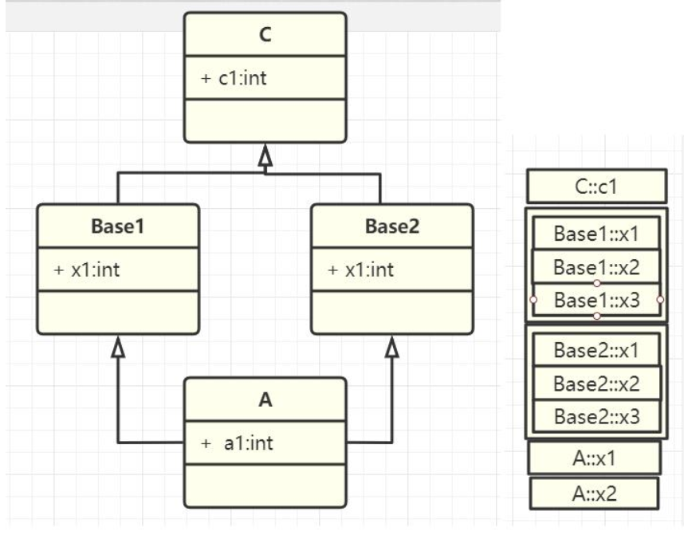
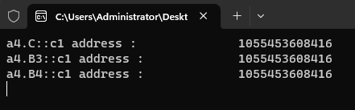

# 14-继承的内存指针分析

# 1. 实验一 : 单一继承

>

[[参考代码]](https://github.com/WONGZEONJYU/cpp_memory_pool_note/blob/main/code/117_inherit_class/117_inherit_class.cpp)

>```c++
>#include <iostream>
>using namespace std;
>
>class Base
>{
>public:
>	int x1{1}, x2{2};
>};
>
>class A : public Base
>{
>public:
>	int a1{ 4 }, x1{ 5 };
>
>};
>
>int main(int argc, char* argv[])
>{
>#if 1
>	/*单继承的内存指针分析*/
>	{
>		Base b;
>		cout << "address b = " << reinterpret_cast<long long>(addressof(b)) << "\n";
>		cout << "b.x1 address : " << reinterpret_cast<long long>(&b.x1) << "\n";
>		cout << "b.x2 address : " << reinterpret_cast<long long>(&b.x2) << "\n";
>
>		A* a { new A() };
>		cout << "address a : \t\t\t" << reinterpret_cast<long long>(a) << "\n";
>		cout << "a->Base::x1 address : \t\t" << reinterpret_cast<long long>(&a->Base::x1) << "\n";
>		cout << "a->Base::x2 address : \t\t" << reinterpret_cast<long long>(&a->Base::x2) << "\n";
>
>		cout << "a->a1 address : \t\t" << reinterpret_cast<long long>(&a->a1) << "\n";
>		cout << "a->x1 address : \t\t" << reinterpret_cast<long long>(&a->x1) << "\n";
>
>		cout << "a->Base::x1 = " << a->Base::x1 << "\n";
>		cout << "a->Base::x2 = " << a->Base::x2 << "\n";
>		cout << "a->a1 = " << a->a1 << "\n";
>		cout << "a->x1 = " << a->x1 << "\n";
>
>		delete a;
>	}
>#endif
>    
>    (void)getchar();
>	return 0;
>}
>```
>
>

# 2. 实验二 : 多继承

>

[[参考代码]](https://github.com/WONGZEONJYU/cpp_memory_pool_note/blob/main/code/117_inherit_class/117_inherit_class.cpp)

>```c++
>#include <iostream>
>using namespace std;
>
>class Base1
>{
>public:
>	int b11{ 1 }, b12{ 2 };
>
>};
>
>class Base2
>{
>public:
>	int b21{ 1 }, b22{ 2 };
>
>};
>
>/* Base1 ==> Base2 ==> A2 地址顺序从左到右 */
>
>class A2 :public Base1, public Base2
>{
>public:
>	int a1{ 5 }, a2{ 6 };
>};
>
>int main(int argc, char* argv[])
>{
>#if 1
>	{
>		/*多继承内存分析*/
>		A2 a;
>		cout << "a address : " << reinterpret_cast<long long>(&a) << "\n";
>		cout << "a.b11 address : " << reinterpret_cast<long long>(&a.b11) << "\n";
>		cout << "a.b12 address : " << reinterpret_cast<long long>(&a.b12) << "\n";
>		cout << "a.b21 address : " << reinterpret_cast<long long>(&a.b21) << "\n";
>		cout << "a.b22 address : " << reinterpret_cast<long long>(&a.b22) << "\n";
>		cout << "a.a1 address : " << reinterpret_cast<long long>(&a.a1) << "\n";
>		cout << "a.a1 address : " << reinterpret_cast<long long>(&a.a2) << "\n";
>	}
>#endif
>
>	(void)getchar();
>	return 0;
>}
>```
>
>

# 3. 实验三 : 多继承的二义性内存分析

>
>
>

[[参考代码]](https://github.com/WONGZEONJYU/cpp_memory_pool_note/blob/main/code/117_inherit_class/117_inherit_class.cpp)

>```c++
>#include <iostream>
>using namespace std;
>
>class C
>{
>public:
>    int c1{};
>};
>
>class B1 : public C
>{
>public:
>    int b1{};
>};
>
>class B2 : public C
>{
>public:
>    int b2{};
>};
>
>class A3 : public B1,public B2
>{
>public:
>    int a3{};
>};
>
>/*
>    C	C
>    B1	B2
>      A3
>*/
>
>int main(int argc, char* argv[])
>{
>	{
>		A3 a;
>		cout << "a.C::c1 address : \t\t" << reinterpret_cast<long long>(&a.C::c1) << "\n";
>		cout << "a.B1::c1 address : \t\t" << reinterpret_cast<long long>(&a.B1::c1) << "\n";
>		cout << "a.B2::c1 address : \t\t" << reinterpret_cast<long long>(&a.B2::c1) << "\n";
>
>	}
>
>    (void)getchar();
>    return 0;
>}
>
>```
>
>

# 4.实验四 : 解决多继承二义性

>

[[参考代码]](https://github.com/WONGZEONJYU/cpp_memory_pool_note/blob/main/code/117_inherit_class/117_inherit_class.cpp)

>```c++
>#include <iostream>
>using namespace std;
>
>class C
>{
>public:
>    int c1{};
>};
>
>class B3 : virtual public C
>{
>public:
>    int b1{};
>};
>
>class B4 : virtual public C
>{
>public:
>    int b2{};
>};
>
>class A4 : public B3, public B4
>{
>public:
>    int a3{};
>};
>
>	/*
>		C
>	B3		B4
>		A4
>	*/
>
>int main(int argc, char* argv[])
>{
>		A4 a4;
>		cout << "a4.C::c1 address : \t\t" << reinterpret_cast<long long>(&a4.C::c1) << "\n";
>		cout << "a4.B3::c1 address : \t\t" << reinterpret_cast<long long>(&a4.B3::c1) << "\n";
>		cout << "a4.B4::c1 address : \t\t" << reinterpret_cast<long long>(&a4.B4::c1) << "\n";
>	}
>
>	(void)getchar();
>	return 0;
>}
>```
>
>

