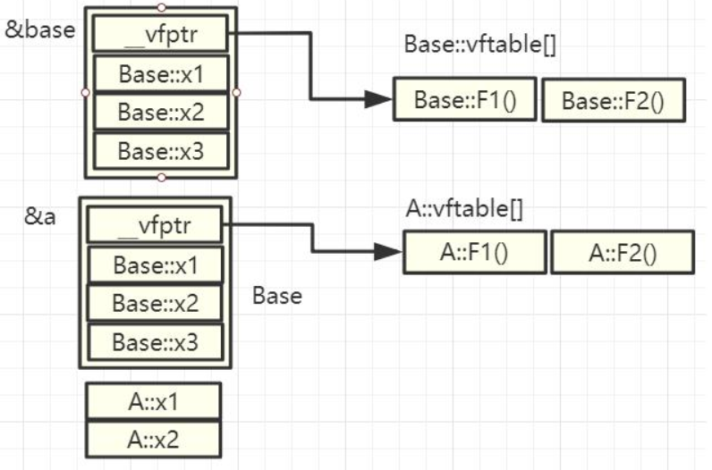
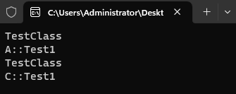
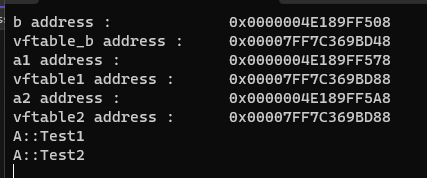
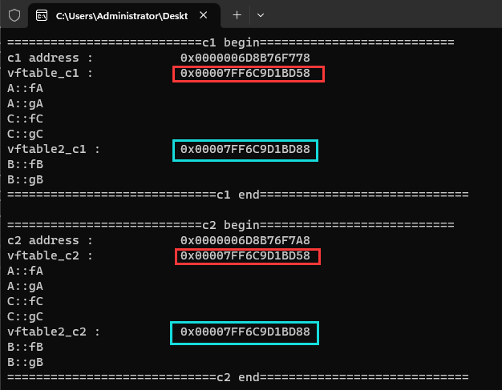

# 15-虚函数指针分析

# 1.虚函数原理与内存分析

## 1.1 前提知识

>- 子类可以定义父类中的同名成员变量(属性)
>- 子类中的成员变量(属性)将隐藏父类中的同名成员变量(属性)
>- 父类中的同名成员变量(属性)依然存在于子类中
>- 通过作用域分辨符 ( `::` ) 访问父类中的同名成员变量(属性)
>- 子类中的函数将隐藏父类的同名函数
>- 子类无法重载父类中的成员函数
>- 使用作用域分辨符 ( `::` )访问父类中的同名函数
>- 子类可以定义父类中完全相同的成员函数

## 1.2基础知识

>虚函数内存占用分析 , 每个虚函数有一个指针  
>
>

## 1.3 实验一

[[参考代码]](https://github.com/WONGZEONJYU/cpp_memory_pool_note/blob/main/code/118_class_virtual_mem/118_class_virtual_mem.cpp)

>```c++
>#include <iostream>
>using namespace std;
>
>/*虚函数表分析*/
>class Base
>{
>public:
>	virtual void Test1() { cout << __FUNCTION__ << "\n"; }
>	virtual void Test2() { cout << __FUNCTION__ << "\n"; }
>	int x1{}, x2{}, x3{};
>};
>
>class A : public Base
>{
>public:
>	void Test1() override { cout << __FUNCTION__ << "\n"; }
>	void Test2() override { cout << __FUNCTION__ << "\n"; }
>};
>
>class C : public Base
>{
>public:
>	void Test1() override  { cout << __FUNCTION__ << "\n"; }
>	void Test2() override  { cout << __FUNCTION__ << "\n"; }
>};
>
>void TestClass(Base *b)
>{
>	cout << __FUNCTION__ << "\n";
>	b->Test1();
>}
>
>int main(int argc, char* argv[])
>{
>	{
>		Base b;
>		A a;
>		TestClass(&a);
>		C c;
>		TestClass(&c);
>    }
>    (void)getchar();
>	return 0;
>}
>```
>
>

# 2. 虚函数表指针字节访问函数(单继承)

## 2.1实验二

[[参考代码]](https://github.com/WONGZEONJYU/cpp_memory_pool_note/blob/main/code/118_class_virtual_mem/118_class_virtual_mem.cpp)

>```c++
>#include <iostream>
>using namespace std;
>
>/*虚函数表分析*/
>class Base
>{
>public:
>	virtual void Test1() { cout << __FUNCTION__ << "\n"; }
>	virtual void Test2() { cout << __FUNCTION__ << "\n"; }
>	int x1{}, x2{}, x3{};
>};
>
>class A : public Base
>{
>public:
>	void Test1() override { cout << __FUNCTION__ << "\n"; }
>	void Test2() override { cout << __FUNCTION__ << "\n"; }
>	void Test3() { cout << __FUNCTION__ << "\n"; };
>};
>
>class C : public Base
>{
>public:
>	void Test1() override  { cout << __FUNCTION__ << "\n"; }
>	void Test2() override  { cout << __FUNCTION__ << "\n"; }
>};
>
>int main(int argc, char* argv[])
>{
>
>	{
>		Base b;
>
>		auto vfptable_b{ reinterpret_cast<long long*>(&b) };
>		/*虚函数表指针,指向虚函数表 vfptable_b --> vftable_b[]*/
>
>		auto vftable_b{ reinterpret_cast<long long*>(*vfptable_b) };
>		/*虚函数表*/
>
>		cout << "b address : \t\t0x" << vfptable_b << "\n";
>		cout << "vftable_b address : \t0x" << vftable_b << "\n";
>
>		A a1;
>		A a2;
>
>		auto vfptable1{ reinterpret_cast<long long*>(&a1) };
>		/*虚函数表指针,指向虚函数表 vfptable1 --> vftable1[]*/
>		auto vftable1{ reinterpret_cast<long long*>(*vfptable1) };
>
>		auto vfptable2{ reinterpret_cast<long long*>(&a2) };
>		/*虚函数表指针,指向虚函数表 vfptable2 --> vftable2[]*/
>		auto vftable2{ reinterpret_cast<long long*>(*vfptable2) };
>
>		/*同一个类模型的不同实例对象 , 虚函数表指针 指向 同一个虚函数表*/
>		cout << "a1 address : \t\t0x" << vfptable1 << "\n";
>		cout << "vftable1 address : \t0x" << vftable1 << "\n";
>		
>		cout << "a2 address : \t\t0x" << vfptable2 << "\n";
>		cout << "vftable2 address : \t0x" << vftable2 << "\n";
>
>		using VFunc = void(*)(void);
>		auto test1{ reinterpret_cast<VFunc>(vftable1[0])};
>		auto test2{ reinterpret_cast<VFunc>(vftable1[1])};
>		test1();
>		test2();
>	}
>    (void)getchar();
>	return 0;
>}
>```
>
>

# 3. 虚函数表指针字节访问函数(多继承)

## 3.1实验三

[[参考代码]](https://github.com/WONGZEONJYU/cpp_memory_pool_note/blob/main/code/119_multiple_inheritance/119_multiple_inheritance.cpp)

>```c++
>#include <iostream>
>
>using namespace std;
>
>class A
>{
>public:
>	virtual void fA() { cout << __FUNCTION__ << "\n"; }
>	virtual void gA() { cout << __FUNCTION__ << "\n"; }
>};
>
>class B
>{
>public:
>	virtual void fB() { cout << __FUNCTION__ << "\n"; };
>	virtual void gB() { cout << __FUNCTION__ << "\n"; };
>};
>
>class C :public A, public B
>{
>	virtual void fC() { cout << __FUNCTION__ << "\n"; }
>	virtual void gC() { cout << __FUNCTION__ << "\n"; }
>};
>
>using VFunc = void(*)();
>using ll = long long;
>
>int main(int argc, char* argv[])
>{
>	C c1, c2;
>	cout << "===========================c1 begin===========================\n";
>	auto vfptable_c1{ reinterpret_cast<ll*>(&c1) };
>	auto vftable_c1{ reinterpret_cast<ll*>(vfptable_c1[0]) }; /*指向第一个继承类的虚函数表*/
>
>	cout << "c1 address : \t\t0x" << vfptable_c1 << "\n";
>	cout << "vftable_c1 : \t\t0x" << vftable_c1 << "\n";
>
>	auto f1{ reinterpret_cast<VFunc>(vftable_c1[0])};
>	auto f2{ reinterpret_cast<VFunc>(vftable_c1[1]) };
>	/*以下两个是 类C 本身的虚函数 , 共同放在同一个虚函数表*/
>	auto f3{ reinterpret_cast<VFunc>(vftable_c1[2]) };
>	auto f4{ reinterpret_cast<VFunc>(vftable_c1[3]) };
>	f1();
>	f2();
>	f3();
>	f4();
>
>	auto vftable2_c1{ reinterpret_cast<ll*>(vfptable_c1[1])}; /*指向第二个继承类的虚函数表*/
>	cout << "vftable2_c1 : \t\t0x" << vftable2_c1 << "\n";
>	f1 = reinterpret_cast<VFunc>(vftable2_c1[0]);
>	f2 = reinterpret_cast<VFunc>(vftable2_c1[1]);
>	f1();
>	f2();
>
>	cout << "=============================c1 end=============================\n\n";
>
>	cout << "===========================c2 begin===========================\n";
>	auto vfptable_c2{ reinterpret_cast<ll*>(&c2) };
>	auto vftable_c2{ reinterpret_cast<ll*>(vfptable_c2[0])};
>
>	cout << "c2 address : \t\t0x" << vfptable_c2 << "\n";
>	cout << "vftable_c2 : \t\t0x" << vftable_c2 << "\n";
>
>	f1 = reinterpret_cast<VFunc>(vftable_c2[0]);
>	f2 = reinterpret_cast<VFunc>(vftable_c2[1]);
>	f3 = reinterpret_cast<VFunc>(vftable_c2[2]);
>	f4 = reinterpret_cast<VFunc>(vftable_c2[3]);
>	f1();
>	f2();
>	f3();
>	f4();
>
>	auto vftable2_c2{ reinterpret_cast<ll*>(vfptable_c2[1])};
>	cout << "vftable2_c2 : \t\t0x" << vftable2_c2 << "\n";
>
>	f1 = reinterpret_cast<VFunc>(vftable2_c2[0]);
>	f2 = reinterpret_cast<VFunc>(vftable2_c2[1]);
>	f1();
>	f2();
>	cout << "=============================c2 end=============================\n\n";
>
>	(void)getchar();
>	return 0;
>}
>
>```
>
>