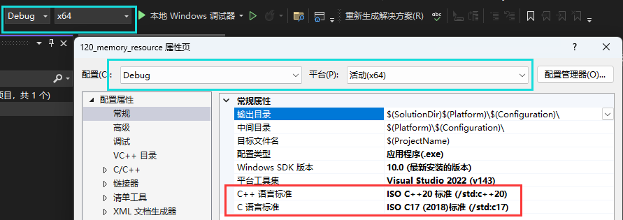

# C++17 memory_resource 内存池

tips: 需编译器支持C++17以上版本

# 1.基础知识

>内存池原理分析
>
>

## 1.1 注意事项

>对于这两个选项 options.max_blocks_per_chunk 和 options.largest_required_pool_block，它们是用来配置内存池的参数设置。
>
>options.max_blocks_per_chunk : 该选项用于设置每个内存块（chunk）中最大的内存块数目。
>内存池通常会将可用的内存划分为较大的内存块，然后将每个内存块进一步划分为更小的内存块，
>以供内存分配使用 。max_blocks_per_chunk 参数定义了在每个内存块中最多可以划分出多少个较小的内存块。
>通过控制内存块中的内存块数量 , 可以调整内存池的管理方式 , 影响内存分配的粒度和性能。
>
>options.largest_required_pool_block：该选项用于设置内存池所需的最大内存块大小。
>当需要分配较大的内存时 , 如果所需大小超过了内存池中最大的内存块大小，
>那么内存池可能无法满足需求。largest_required_pool_block 用来确定内存池所需的最大内存块大小，
>以便在内存分配时进行适当的处理和管理。
>
>这两个选项通常在内存池的配置中使用，用于调整内存池的性能和内存分配策略。
>通过适当地配置 max_blocks_per_chunk 和 largest_required_pool_block 可以优化内存池的利用率、并发处理能力和内存分配效率。
>
>请注意 , 具体的选项名称和定义可能会因不同的内存池实现而有所差异。建议查阅相关文档或参考库的使用说明以了解特定内存池实现中这些选项的详细含义和用法。
>
>**内存申请是呈指数级增长**
>
>```tex
>例如:max_blocks_per_chunk 设置 1024 * 1024 * 100 = 100M
>初始化之后内存池从上游分配好100m
>在100M分配完成之后,需要继续分配的时候,内存池从上游继续申请100M,又分配完之后,内存池这个时候就向上申请200M,下一次400M,下一次800M,呈指数级增长
>
>
>如果自定义大小超出largest_required_pool_block大小,每次就按照自定义大小分配
>```

# 2. 实验一 (向内存池申请空间)

## 2.1 vs2022工程配置

>

[[参考代码]]()

>```c++
>#include <iostream>
>#include <memory_resource>
>#include <vector>
>#include <thread>
>using namespace std;
>using namespace pmr;
>using namespace chrono;
>
>int main(int argc, char* argv[])
>{
>	pool_options opt;
>	opt.largest_required_pool_block = 1024 * 1024 * 10;	/*大数据块的字节数 */
>	/**/
>	/*10M*/
>	opt.max_blocks_per_chunk = 1024 * 1024 * 100;		/*普通数据,每块数据块的大小*/
>	/*100M*/
>
>	/*线程安全的内存池*/
>	synchronized_pool_resource mpool(opt);
>	std::vector<void*> datas;
>
>	constexpr int size{ 1024 * 1024 }; /*1M*/
>
>	for (int i{}; i < 2048; i++){
>		try {
>			/*从内存池申请一块空间*/
>			auto data{ mpool.allocate(size) };
>			datas.push_back(data);
>			cout << "+" << flush;
>			this_thread::sleep_for(milliseconds(10));
>		}
>		catch (const std::exception& ex) {
>			cerr << "mpool.allocate failed!" << ex.what() << "\n";
>			exit(-1);
>		}
>	}
>
>	(void)getchar();
>	return 0;
>}
>
>```
>
>```c++
>/*分配内存源码(部分源码)*/
>
>void* do_allocate(size_t _Bytes, const size_t _Align) override {
>            // allocate a block from the appropriate pool, or directly from upstream if too large
>    if (_Bytes <= _Options.largest_required_pool_block) {
>        auto _Result = _Find_pool(_Bytes, _Align);
>        if (_Result.first == _Pools.end() || _Result.first->_Log_of_size != _Result.second) {
>            _Result.first = _Pools.emplace(_Result.first, _Result.second);
>        }
>
>        return _Result.first->_Allocate(*this);
>    }
>
>    return _Allocate_oversized(_Bytes, _Align);
>}
>```
>
>申请成功没有异常
>
>
>
>申请失败,抛出异常,并捕获异常,程序推出
>
>

# 3. 实验二 (内存池空间释放)

[[参考代码]]()

>```c++
>
>
>#include <iostream>
>#include <memory_resource>
>#include <vector>
>#include <thread>
>using namespace std;
>using namespace pmr;
>using namespace chrono;
>
>/*
>
>对于这两个选项 options.max_blocks_per_chunk 和 options.largest_required_pool_block，它们是用来配置内存池的参数设置。
>
>options.max_blocks_per_chunk：该选项用于设置每个内存块（chunk）中最大的内存块数目。
>内存池通常会将可用的内存划分为较大的内存块，然后将每个内存块进一步划分为更小的内存块，
>以供内存分配使用。max_blocks_per_chunk 参数定义了在每个内存块中最多可以划分出多少个较小的内存块。
>通过控制内存块中的内存块数量，可以调整内存池的管理方式，影响内存分配的粒度和性能。
>
>options.largest_required_pool_block：该选项用于设置内存池所需的最大内存块大小。
>当需要分配较大的内存时，如果所需大小超过了内存池中最大的内存块大小，
>那么内存池可能无法满足需求。largest_required_pool_block 用来确定内存池所需的最大内存块大小，
>以便在内存分配时进行适当的处理和管理。
>
>这两个选项通常在内存池的配置中使用，用于调整内存池的性能和内存分配策略。
>通过适当地配置 max_blocks_per_chunk 和 largest_required_pool_block 可以优化内存池的利用率、并发处理能力和内存分配效率。
>
>请注意，具体的选项名称和定义可能会因不同的内存池实现而有所差异。建议查阅相关文档或参考库的使用说明以了解特定内存池实现中这些选项的详细含义和用法。
>
>*/
>
>int main(int argc, char* argv[])
>{
>	pool_options opt;
>	opt.largest_required_pool_block = 1024 * 1024 * 10;	/*大数据块的字节数 */
>	/*10M*/
>	opt.max_blocks_per_chunk = 1024 * 1024 * 100;		/*普通数据,每块数据块的大小*/
>	/*如果一个数据块分配完了，还需要继续分配的话,内存会先去申请max_blocks_per_chunk个回来*/
>	/*如果当个数据块超出了largest_required_pool_block,则按照*/
>	/*100M*/
>
>	/*线程安全的内存池*/
>	synchronized_pool_resource mpool(opt);
>	std::vector<void*> datas;
>
>	constexpr int size{ 1024 * 1024  }; /*1M*/
>
>	for (int i{}; i < 256; i++){	/*一共申请1G*/
>		try {
>			/*从内存池申请一块空间*/
>			auto data{ mpool.allocate(size) }; /*每次申请1M*/
>			datas.push_back(data);
>			cout << "+" << flush;
>			this_thread::sleep_for(milliseconds(20));
>		}
>		catch (const std::exception& ex) {
>			cerr << "mpool.allocate failed!" << ex.what() << "\n";
>			exit(-1);
>		}
>	}
>	
>	auto b1{ mpool.allocate(1024 * 1024 * 20) }; /*申请大块空间*/
>	mpool.deallocate(b1, 1024 * 1024 * 20);
>
>	for (auto &d : datas) { /*回收空间*/
>		mpool.deallocate(d, size);
>		cout << "-" << flush;
>		this_thread::sleep_for(milliseconds(20));
>	}
>
>	mpool.release(); /*释放内存池所有内存*/
>
>	(void)getchar();
>	return 0;
>}
>
>```
>
>```c++
>/*回收源码(部分)*/
>void do_deallocate(void* const _Ptr, const size_t _Bytes, const size_t _Align) override {
>    // deallocate a block from the appropriate pool, or directly from upstream if too large
>    if (_Bytes <= _Options.largest_required_pool_block) {
>        const auto _Result = _Find_pool(_Bytes, _Align);
>        if (_Result.first != _Pools.end() && _Result.first->_Log_of_size == _Result.second) {
>            _Result.first->_Deallocate(*this, _Ptr);
>        }
>    } else {
>        _Deallocate_oversized(_Ptr, _Bytes, _Align);
>    }
>}
>```
>
>