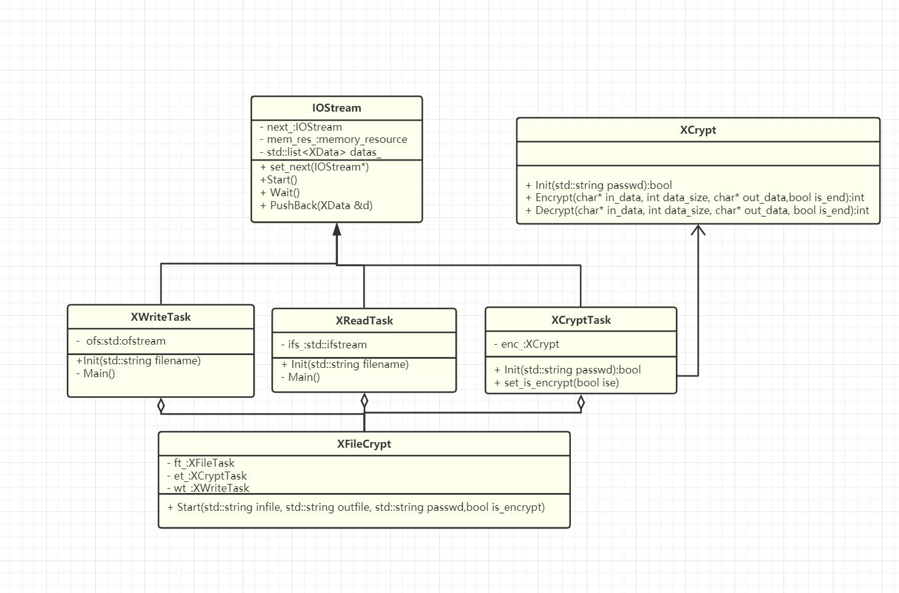
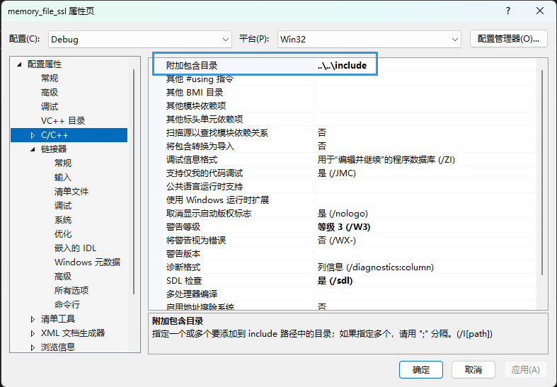
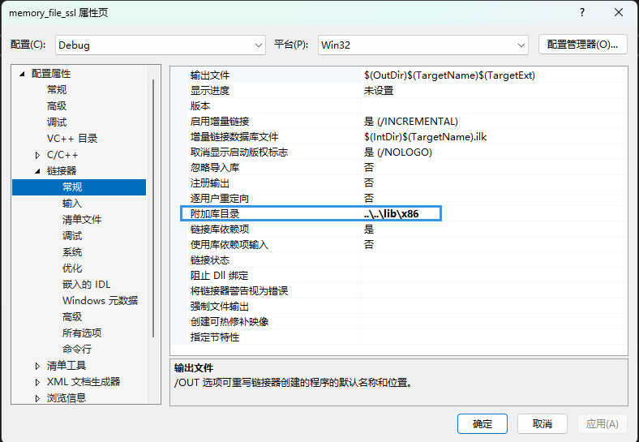
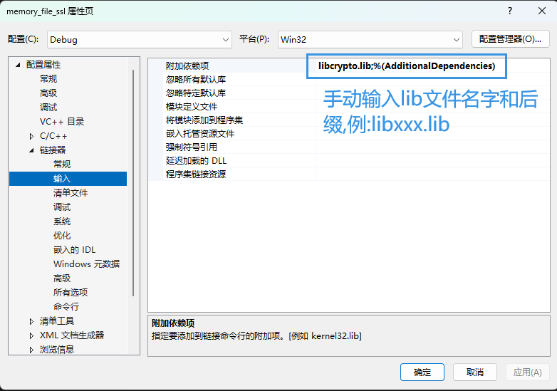
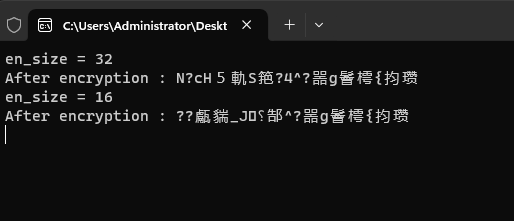

# 实战基于 c++17、多线程、内存池批量文件加解密程序

# 1.基本技术

* 用到多线程技术 , 详见多线程课程
* 用到加解密技术 详见 `openssl` 课程
* 用到 **$\color{red}{责任链模式}$**
* 用到智能指针、 内存池、 线程相关技术  

# 2. 类图



# 3. 类作用

* `IOStream` (线程基类) :  责任链模式 , 多线程数据传递 , 内存池注入和空间管理
* `XReadTask` (文件读取类) : 继承 `IOStream` 读取文件 , 发送给下一个责任链 , 需要告知下一个责任链任务结束
* `XWriteTask` (文件写入类) : 继承 `IOStream` , 写入文件现场, 接收 `XEncryptTask` 类 发送的加解密数据
* `XCryptTask` (加解密线程类) : 继承 `IOStream` , 关联 `XCrypt` , 加解密处理线程
* `XCrypt` (加解密类) : 组合 `XCryptTask XWriteTask `
* `XFileCrypt` (操作组合类) 

# 4. 实验

[[工程参考链接]]()

## 4.1 工程配置

 

  

 

 

## 4.2 `XCrypt` 类创建

### 4.2.1 `xcrypt.h`

>```c++
>#ifndef XCRYPT_H_
>#define XCRYPT_H_
>
>#include <string>
>#include <openssl/des.h>
>
>class XCrypt
>{
>public:
>
>	/// <summary>
>	/// 初始化密钥 , DES加密算法 密钥最多8bit 多余丢弃不足补0
>	/// </summary>
>	/// <param name="password"></param>
>	/// <returns>ture or false</returns>
>
>	bool Init(std::string password);
>
>	 /// <summary>
>	 /// 加密数据,结尾填充补充的大小 加密数据大小如果不是 8, 16的倍数
>	 /// </summary>
>	 /// <param name="in_data">输入数据</param>
>	 /// <param name="insize">输入数据大小</param>
>	 /// <param name="out_data">输出数据</param>
>	 /// <param name="is_end">是否到加密结尾</param>
>	 /// <returns>0 or size 返回加密后数据大小, 有可能大于输入 , 添加补充</returns>
>
>	size_t Encrypt(const char* in_data,size_t insize,
>		char* out_data, bool is_end = false) ;
>
>	 /// <summary>
>	 /// 解密数据,结尾去掉填充大小
>	 /// </summary>
>	 /// <param name="in_data">输入数据</param>
>	 /// <param name="insize">输入数据大小</param>
>	 /// <param name="out_data">输出数据</param>
>	 /// <param name="is_end">是否到加密结尾</param>
>	 /// <returns>-1 or size 返回解密后数据大小 , 有可能小于输入 , 去掉补充</returns>
>
>	size_t Decrypt(const char* in_data, size_t insize,
>		char* out_data,bool is_end = false);
>
>private:
>	/*存储密钥*/
>	DES_key_schedule key_sch_;
>};
>
>#endif // 
>```

### 4.2.2 `xcrypt.cpp`

#### 4.2.2.1 初始化和加密API实现

> ```c++
> #include "xcrypt.h"
> 
> /*初始化密钥 , DES加密算法 密钥最多8bit 多余丢弃不足补0*/
> bool XCrypt::Init(std::string password)
> {
>     const_DES_cblock key{}; /*不足补0,初始化就置0*/
>     auto key_size{ password.size()};
> 
>     if (key_size > sizeof(key)){ /*多余丢弃*/
>         key_size = sizeof(key);
>     }
>     
>     memcpy(key, password.c_str(), key_size);
>     (void)DES_set_key(&key,&key_sch_);
>     return true;
> }
> 
> /// <summary>
> /// 加密数据,结尾填充补充的大小 加密数据大小如果不是 8, 16的倍数
> /// </summary>
> /// <param name="in_data">输入数据</param>
> /// <param name="insize">输入数据大小</param>
> /// <param name="out_data">输出数据</param>
> /// <param name="is_end">是否到加密结尾</param>
> /// <returns>0 or size 返回加密后数据大小, 有可能大于输入 , 添加补充</returns>
> /// 
> /// 
> size_t XCrypt::Encrypt(const char* in_data, const size_t insize, char* out_data, bool is_end)
> {
>     if ((!in_data) || (!out_data) || (insize <= 0)) {
>         return -1;
>     }
> 
>     const auto block_size{ sizeof(const_DES_cblock) }, over{ insize % block_size },
>         padding{ block_size - over };
> 
>     size_t write_size{}, data_size{};
> 
>     for (size_t i{}; i < insize; i+= block_size){
> 
>         const_DES_cblock in{}; /*输入(未加密数据)*/
>         DES_cblock out{};/*输出(加密后数据)*/
> 
>         const auto temp_v{ insize - i };
> 
>         data_size = (temp_v < block_size) ? temp_v : block_size;
> 
>         memcpy(in, in_data + write_size, data_size);
> 
>         /*填充 补充的数据大小 @@@@@@@1 @@@55555 @@@@@@@@88888888*/
>         const auto r{ is_end && ((i + block_size) >= insize) };
> 
>         if (r){
>             //@@@@@@@@8888888
>             if (padding == block_size) { /*补充多8个字节*/
>                 DES_ecb_encrypt(&in, &out, &key_sch_, DES_ENCRYPT);
>                 memcpy(out_data + write_size, &out, block_size);
>                 write_size += block_size;
>                 memset(in, padding, sizeof(in)); //填充8
>             }else{ //@@@@@@@1   @@@55555
>                 memset(in + over, padding, padding);
>             }
>         }
> 
>         DES_ecb_encrypt(&in,&out,&key_sch_,DES_ENCRYPT);
>         memcpy(out_data + write_size, &out, block_size);
>         write_size += block_size;
>     }
> 
>     return write_size;
> }
> 
> ```

#### 4.2.2.2 加密测试

> ```c++
> #include <iostream>
> #include "xcrypt.h"
> 
> using namespace std;
> 
> int main(int argc, char* argv[])
> {
> 	XCrypt crypt;
> 	crypt.Init("12345678");
> 
> 	char out[1024]{};
> 
> 	auto en_size{ crypt.Encrypt("abcdefgh",24, out,true) };/*8的倍数*/
> 	cout << "en_size = " << en_size << "\nAfter encryption : " << 
> 			out << "\n";
> 
> 	en_size = crypt.Encrypt("abcdefg", 9, out, true);/*非8的倍数*/
> 	cout << "en_size = " << en_size << "\nAfter encryption : " <<
> 		out << "\n";
> 
> 	(void)getchar();
> 	return 0;
> }
> 
> ```

   

