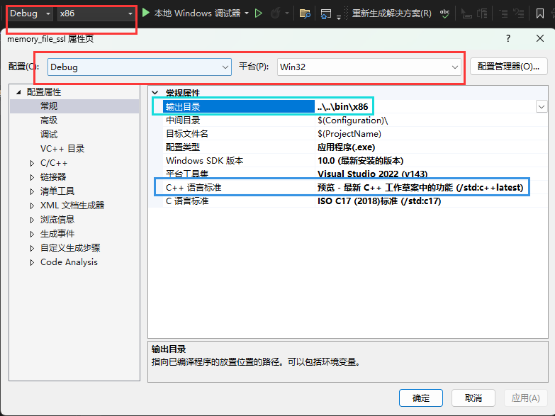

# 实战基于 c++17、多线程、内存池批量文件加解密程序

# 1.基本技术

* 用到多线程技术 , 详见多线程课程
* 用到加解密技术 详见 `openssl` 课程
* 用到 **$\color{red}{责任链模式}$**
* 用到智能指针、 内存池、 线程相关技术  

# 2. 类图

# 3. 类作用

* `IOStream` (线程基类) :  责任链模式 , 多线程数据传递 , 内存池注入和空间管理
* `XReadTask` (文件读取类) : 继承 `IOStream` 读取文件 , 发送给下一个责任链 , 需要告知下一个责任链任务结束
* `XWriteTask` (文件写入类) : 继承 `IOStream` , 写入文件现场, 接收 `XEncryptTask` 类 发送的加解密数据
* `XCryptTask` (加解密线程类) : 继承 `IOStream` , 关联 `XCrypt` , 加解密处理线程
* `XCrypt` (加解密类) : 组合 `XCryptTask XWriteTask `
* `XFileCrypt` (操作组合类) 

# 4. 实验

[[工程参考链接]]()

## 4.1 工程配置

 

  

 

 

## 4.2  `XCrypt 加密代码`

