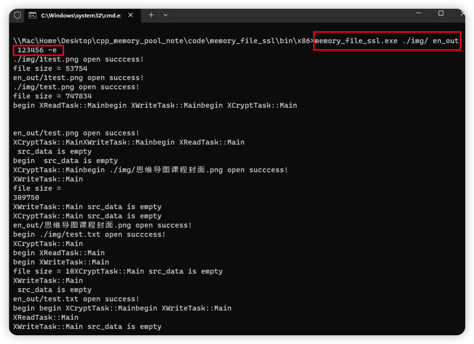

# 实战基于 c++17、多线程、内存池批量文件加解密程序

# 1. 基本技术

* 用到多线程技术 , 详见多线程课程
* 用到加解密技术 详见 `openssl` 课程
* 用到 **$\color{red}{责任链模式}$**
* 用到智能指针、 内存池、 线程相关技术  

# 2. 类图


# 3. 类作用

* `IOStream` (线程基类) :  责任链模式 , 多线程数据传递 , 内存池注入和空间管理
* `XReadTask` (线程文件读取类) : 继承 `IOStream` 读取文件 , 发送给下一个责任链 , 需要告知下一个责任链任务结束
* `XWriteTask` (线程文件写入类) : 继承 `IOStream` , 写入文件现场, 接收 `XEncryptTask` 类 发送的加解密数据
* `XCryptTask` (线程加解密类) : 继承 `IOStream` , 关联 `XCrypt` , 加解密处理线程
* `XCrypt` (加解密类) : 组合 `XCryptTask XWriteTask `
* `XFileCrypt` (操作组合类) 

# 4. 实验

[[工程参考链接]](/code/memory_file_ssl)

* 代码会不断迭代 , 请以工程参考链接的为准

## 4.1 工程配置

 

  

 

 

## 4.2 `XCrypt` 类创建

### 4.2.1 `xcrypt.h`

>```c++
>#ifndef XCRYPT_H_
>#define XCRYPT_H_
>
>#include <string>
>#include <openssl/des.h>
>
>class XCrypt
>{
>public:
>
>	/// <summary>
>	/// 初始化密钥 , DES加密算法 密钥最多8bit 多余丢弃不足补0
>	/// </summary>
>	/// <param name="password"></param>
>	/// <returns>ture or false</returns>
>
>	bool Init(std::string password);
>
>	 /// <summary>
>	 /// 加密数据,结尾填充补充的大小 加密数据大小如果不是 8, 16的倍数
>	 /// </summary>
>	 /// <param name="in_data">输入数据</param>
>	 /// <param name="insize">输入数据大小</param>
>	 /// <param name="out_data">输出数据</param>
>	 /// <param name="is_end">是否到加密结尾</param>
>	 /// <returns>0 or size 返回加密后数据大小, 有可能大于输入 , 添加补充</returns>
>
>	size_t Encrypt(const char* in_data,size_t insize,
>		char* out_data, bool is_end = false) ;
>
>	 /// <summary>
>	 /// 解密数据,结尾去掉填充大小
>	 /// </summary>
>	 /// <param name="in_data">输入数据</param>
>	 /// <param name="insize">输入数据大小</param>
>	 /// <param name="out_data">输出数据</param>
>	 /// <param name="is_end">是否到加密结尾</param>
>	 /// <returns>-1 or size 返回解密后数据大小 , 有可能小于输入 , 去掉补充</returns>
>
>	size_t Decrypt(const char* in_data, size_t insize,
>		char* out_data,bool is_end = false);
>
>private:
>	/*存储密钥*/
>	DES_key_schedule key_sch_;
>};
>
>#endif // 
>```

### 4.2.2 `xcrypt.cpp`

#### 4.2.2.1 初始化和加密 `API` 实现

> ```c++
> #include "xcrypt.h"
> 
> /*初始化密钥 , DES加密算法 密钥最多8bit 多余丢弃不足补0*/
> bool XCrypt::Init(std::string password)
> {
>     const_DES_cblock key{}; /*不足补0,初始化就置0*/
>     auto key_size{ password.size()};
> 
>     if (key_size > sizeof(key)){ /*多余丢弃*/
>         key_size = sizeof(key);
>     }
>     
>     memcpy(key, password.c_str(), key_size);
>     (void)DES_set_key(&key,&key_sch_);
>     return true;
> }
> 
> /// <summary>
> /// 加密数据,结尾填充补充的大小 加密数据大小如果不是 8, 16的倍数
> /// </summary>
> /// <param name="in_data">输入数据</param>
> /// <param name="insize">输入数据大小</param>
> /// <param name="out_data">输出数据</param>
> /// <param name="is_end">是否到加密结尾</param>
> /// <returns>0 or size 返回加密后数据大小, 有可能大于输入 , 添加补充</returns>
> /// 
> /// 
> size_t XCrypt::Encrypt(const char* in_data, const size_t insize, char* out_data, bool is_end)
> {
>     if ((!in_data) || (!out_data) || (insize <= 0)) {
>         return -1;
>     }
> 
>     const auto block_size{ sizeof(const_DES_cblock) }, over{ insize % block_size },
>         padding{ block_size - over };
> 
>     size_t write_size{}, data_size{};
> 
>     for (size_t i{}; i < insize; i+= block_size){
> 
>         const_DES_cblock in{}; /*输入(未加密数据)*/
>         DES_cblock out{};/*输出(加密后数据)*/
> 
>         const auto temp_v{ insize - i };
> 
>         data_size = (temp_v < block_size) ? temp_v : block_size;
> 
>         memcpy(in, in_data + write_size, data_size);
> 
>         /*填充 补充的数据大小 @@@@@@@1 @@@55555 @@@@@@@@88888888*/
>         const auto r{ is_end && ((i + block_size) >= insize) };
> 
>         if (r){
>             //@@@@@@@@8888888
>             if (padding == block_size) { /*补充多8个字节*/
>                 DES_ecb_encrypt(&in, &out, &key_sch_, DES_ENCRYPT);
>                 memcpy(out_data + write_size, &out, block_size);
>                 write_size += block_size;
>                 memset(in, padding, sizeof(in)); //填充8
>             }else{ //@@@@@@@1   @@@55555
>                 memset(in + over, padding, padding);
>             }
>         }
> 
>         DES_ecb_encrypt(&in,&out,&key_sch_,DES_ENCRYPT);
>         memcpy(out_data + write_size, &out, block_size);
>         write_size += block_size;
>     }
> 
>     return write_size;
> }
> 
> ```

#### 4.2.2.2 加密测试

> ```c++
> #include <iostream>
> #include "xcrypt.h"
> 
> using namespace std;
> 
> int main(int argc, char* argv[])
> {
> 	XCrypt crypt;
> 	crypt.Init("12345678");
> 
> 	char out[1024]{};
> 
> 	auto en_size{ crypt.Encrypt("abcdefgh",24, out,true) };/*8的倍数*/
> 	cout << "en_size = " << en_size << "\nAfter encryption : " << 
> 			out << "\n";
> 
> 	en_size = crypt.Encrypt("abcdefg", 9, out, true);/*非8的倍数*/
> 	cout << "en_size = " << en_size << "\nAfter encryption : " <<
> 		out << "\n";
> 
> 	(void)getchar();
> 	return 0;
> }
> 
> ```

   

#### 4.2.2.3 解密实现

>```c++
>/// <summary>
>/// 解密数据,结尾去掉填充大小
>/// </summary>
>/// <param name="in_data">输入数据</param>
>/// <param name="insize">输入数据大小</param>
>/// <param name="out_data">输出数据</param>
>/// <param name="is_end">是否到加密结尾</param>
>/// <returns>-1 or size 返回解密后数据大小 , 有可能小于输入 , 去掉补充</returns>
>
>size_t XCrypt::Decrypt(const char* in_data, const size_t insize, char* out_data, const bool is_end)
>{
>        if ((!in_data) || (!out_data) || (insize <= 0)) {
>            return 0;
>        }
>
>        const auto block_size{ sizeof(const_DES_cblock) }, over{ insize % block_size },
>            padding{ block_size - over };
>
>        size_t write_size{}, data_size{};
>
>        for (size_t i {}; i < insize; i+= block_size) {
>
>            const_DES_cblock in{}; /*输入(已加密数据)*/
>            DES_cblock out{};/*输出(解密后数据)*/
>
>            memcpy(&in, in_data + write_size, block_size);
>            DES_ecb_encrypt(&in, &out, &key_sch_, DES_DECRYPT); /*解密*/
>
>            data_size = block_size;/*默认情况data_size == block_size*/
>
>            /*处理结尾处*/
>
>            /*如果数据长度不是8的倍数，那么最后一块数据不足8个字节的位置都会被填充为剩余的长度大小这个数值
>            * 比如 @@@55555 , 5是从第三个位置开始填充,到结尾也是5,所以out[7] == 5
>            */
>
>            const auto is_ { is_end && ((insize - i) <= block_size)};
>
>            if (is_){
>
>                data_size = block_size - out[7]; 
>                /*通过最后一个元素的值可以计算出还需拷贝多少个数据*/
>
>                if (!data_size){ /*如果是8的倍数,data_size == 0*/
>                    break;
>                }else if(data_size < 0){ /*异常情况*/
>                    cerr << "Decrypt failed!padding size error\n";
>                    break;
>                }else { /*正常情况*/
>
>                }
>            }
>
>            memcpy(out_data + write_size, &out, data_size);
>            write_size += block_size;
>        }
>
>    	return write_size;
>}
>```

#### 4.2.2.3 解密测试

>```c++
>#include <iostream>
>#include "xcrypt.h"
>
>using namespace std;
>
>int main(int argc, char* argv[])
>{
>	XCrypt crypt;
>	crypt.Init("12345678");
>
>#if 1
>	{
>		cout << "====================1 begin======================\n";
>
>		char out[1024]{};
>		auto en_size{ crypt.Encrypt("abcdefghijklmn",24, out,true) };/*8的倍数*/
>		cout << "en_size = " << en_size << 
>			"\nAfter encryption : " << out << "\n";
>
>		char de_out[1024]{};
>		auto de_size{ crypt.Decrypt(out, en_size,de_out, true) };
>		cout << "de_size = " << de_size <<
>				"\nde_out : " << de_out << "\n";
>
>		cout << "=====================1 end=======================\n\n";
>	}
>
>	{
>		cout << "====================2 begin======================\n";
>		char out[1024]{};
>		auto en_size{ crypt.Encrypt("abcdefgh",8, out,true) };
>		cout << "en_size = " << en_size << "\nAfter encryption : " <<
>		out << "\n";
>
>		char de_out[1024]{};
>		auto de_size{ crypt.Decrypt(out, en_size,de_out, true) };
>		cout << "de_size = " << de_size <<
>			"\nde_out : " << de_out << "\n";
>		cout << "=====================2 end=======================\n\n";
>	}
>
>	{
>		cout << "====================3 begin======================\n";
>		char out[1024]{};
>		auto en_size = crypt.Encrypt("abcdefghi", 9, out, true);
>		cout << "en_size = " << en_size << 
>				"\nAfter encryption : " << out << "\n";
>
>		char de_out[1024]{};
>		auto de_size{ crypt.Decrypt(out, en_size,de_out, true) };
>		cout << "de_size = " << de_size <<
>			"\nde_out : " << de_out << "\n";
>		cout << "=====================3 end=======================\n\n";
>	}
>#endif
>	(void)getchar();
>	return 0;
>}
>
>```

 

## 4.3 创建 `XIOStream` 类

### 4.3.1 `xiostream.h`

>```c++
>#ifndef XIOSTREAM_H_
>#define XIOSTREAM_H_
>
>#include <thread>
>
>class XIOStream
>{
>	XIOStream(const XIOStream&) = delete;
>	XIOStream(XIOStream&&) = delete;
>	XIOStream& operator=(const XIOStream&) = delete;
>	XIOStream& operator=(XIOStream&&) = delete;
>
>public:
>	explicit XIOStream() = default;
>	/// <summary>
>	/// 线程启动
>	/// </summary>
>	void Start();
>
>	/// <summary>
>	/// 等待线程退出
>	/// </summary>
>	void Wait();
>
>	/// <summary>
>	/// 线程退出,需要用Wait等待
>	/// </summary>
>	void Stop();
>
>protected:
>	/// <summary>
>	/// 线程入口函数
>	/// </summary>
>	virtual void Main() {}
>
>	/// <summary>
>	/// 
>	/// </summary>
>	/// <returns></returns>
>	constexpr bool is_exit() const noexcept { return is_exit_; };
>
>	/// <summary>
>	/// 保存文件大小
>	/// </summary>
>	/// <param name=""></param>
>	void Ass_data_byte(uint64_t);
>
>	/// <summary>
>	/// 获取文件大小
>	/// </summary>
>	/// <returns></returns>
>	uint64_t xs_data_byte() const;
>
>private:
>	std::thread th_;
>	bool is_exit_{};
>	uint64_t data_byte_{};
>};
>
>#endif
>
>```

### 4.3.2 `xiostream.cpp`

>```c++
>#include "xiostream.h"
>
>using namespace std;
>
>/// <summary>
>/// 线程启动
>/// </summary>
>void XIOStream::Start() {
>	th_ = thread(&XIOStream::Main, this);
>}
>
>/// <summary>
>/// 等待线程退出
>/// </summary>
>void XIOStream::Wait() {
>	if (th_.joinable()) {
>		th_.join();
>	}
>}
>/// <summary>
>/// 线程退出,需要用Wait等待
>/// </summary>
>void XIOStream::Stop() {
>	is_exit_ = true;
>}
>/// <summary>
>/// 保存文件大小
>/// </summary>
>/// <param name=""></param>
>void XIOStream::Ass_data_byte(const uint64_t n) {
>	data_byte_ = n;
>}
>/// <summary>
>/// 获取文件大小
>/// </summary>
>/// <returns></returns>
>uint64_t XIOStream::xs_data_byte() const {
>	return data_byte_;
>}
>
>```

## 4.4 创建 `XReadTask` 类

### 4.4.1 `XReadTask.h`

>```c++
>#ifndef XREADTASK_H_
>#define XREADTASK_H_
>
>#include "xiostream.h"
>#include <string>
>#include <fstream>
>
>class XReadTask : public XIOStream
>{
>public:
>	/// <summary>
>	/// 初始化读取线程,获取文件大小
>	/// </summary>
>	/// <param name="filename"></param>
>	/// <returns></returns>
>	bool Init(std::string filename);
>
>private:
>	/// <summary>
>	/// 线程入口函数
>	/// </summary>
>	void Main() override;
>	std::ifstream ifs_;
>};
>
>#endif
>```

### 4.4.2 `XReadTask.cpp`

>```c++
>#include "xreadtask.h"
>#include <iostream>
>#include <thread>
>
>using namespace std;
>using namespace chrono;
>using namespace this_thread;
>
>/// <summary>
>/// 初始化读取线程,获取文件大小
>/// </summary>
>/// <param name="filename"></param>
>/// <returns></returns>
>bool XReadTask::Init(string filename)
>{
>	if (filename.empty()){
>		return false;
>	}
>	
>	ifs_.open(filename, ios::binary);
>
>	if (!ifs_){
>		cerr << "open file " << filename << " failed!\n";
>		return false;
>	}
>
>	cout << "open succcess!\n";
>
>	ifs_.seekg(0, ios::end);/*Move to end of file*/
>
>	Ass_data_byte(ifs_.tellg());
>
>	ifs_.seekg(0, ios::beg); /*Move to beginning of file*/
>
>	cout << " file size = " << xs_data_byte() << "\n";
>
>	return true;
>}
>
>void XReadTask::Main()
>{
>	cout << "begin " << __FUNCTION__ << "\n";
>	while (!is_exit()){
>		if (ifs_.eof()){
>			break;
>		}
>
>		char buf[1024 * 10]{};
>		ifs_.read(buf, sizeof(buf));
>		cout << "[" << ifs_.gcount() << "] " << flush;
>
>	}
>	cout << "\nend " << __FUNCTION__ << "\n";
>}
>
>```

### 4.4.3 没有内存池,文件读取测试

>```c++
>#include <iostream>
>#include "xcrypt.h"
>#include "xreadtask.h"
>
>using namespace std;
>
>int main(int argc, char* argv[])
>{	
>    	XReadTask rt;
>	rt.Init("../../bin/x86/img/test.png");
>	rt.Start();
>	rt.Wait();
>
>	(void)getchar();
>	return 0;
>}
>
>```

 

## 4.5 创建 `XData` 类

### 4.5.1 `XData.h`

>```c++
>#ifndef XDATA_H
>#define XDATA_H
>
>#include <memory>
>#include <memory_resource>
>
>class XData final
>{
>	explicit XData() = default;
>	XData(const XData& ) = delete;
>	XData(XData&&) = delete;
>	XData& operator=(const XData&) = delete;
>	XData& operator=(XData&&) = delete;
>
>public:
>	using _sp_mrs_type = std::shared_ptr<std::pmr::memory_resource>;
>	using _sp_xdata_type = std::shared_ptr<XData>;
>	/// <summary>
>	/// 创建空间
>	/// </summary>
>	/// <param name="">占用内存字节数</param>
>	/// <returns></returns>
>	void* New(uint64_t);
>
>	/// <summary>
>	/// 设置实际数据字节数
>	/// </summary>
>	/// <param name=""></param>
>	void set_size(const uint64_t s) {size_ = s;}
>
>   	/// <summary>
>	/// 返回实际数据字节数
>	/// </summary>
>	/// <returns></returns>
>	uint64_t size() const { return size_; }
>    
>	/// <summary>
>	/// 创建XData智能指针对象
>	/// </summary>
>	/// <param name="pool"></param>
>	/// <returns></returns>
>	static _sp_xdata_type Make(const _sp_mrs_type& );
>
>	~XData();
>
>private:
>	void* data_{};
>	uint64_t size_{};/*数据字节数*/
>	uint64_t mem_size_{};/*占用空间字节数*/
>	_sp_mrs_type mem_pool_;
>};
>
>#endif
>```

### 4.5.2 `XData.cpp`

>```c++
>#include "xdata.h"
>#include <iostream>
>
>using namespace std;
>using namespace pmr;
>
>/// <summary>
>/// 创建XData智能指针对象
>/// </summary>
>/// <param name="pool"></param>
>/// <returns></returns>
>XData::_sp_xdata_type XData::Make(const _sp_mrs_type& pool)
>{
>	_sp_xdata_type ptr{ new XData() };
>	ptr->mem_pool_ = pool;
>	cout << "+" << flush;
>	return ptr;
>}
>
>/// <summary>
>/// 创建空间
>/// </summary>
>/// <param name="">占用内存字节数</param>
>/// <returns></returns>
>void* XData::New(const uint64_t mem_size)
>{
>	if (mem_size <= 0){
>		cerr << __FUNCTION__ << " failed! mem_size <=0\n";
>		return {};
>	}
>
>	if (!mem_pool_){
>		cerr << __FUNCTION__ << " failed! mem_pool Uninitialized\n";
>		return {};
>	}
>
>	data_ = mem_pool_->allocate(mem_size);
>	mem_size_ = mem_size_;
>	size_ = mem_size_;
>	cout << "-" << flush;
>	return data_;
>}
>
>XData::~XData()
>{
>	const auto is_{ ((!data_) || (!mem_pool_)) };
>
>	if (is_){
>		return;
>	}
>
>	mem_pool_->deallocate(data_, mem_size_);
>	data_ = nullptr;
>	size_ = 0;
>}
>
>```

## 4.6 迭代 `XIOStream` 类

```tex
没有特别说明增加的成员是否为静态成员,一律都是非静态成员
```

* 增加内存池相关非静态成员变量和接口 
  * `_sp_mrs_type mem_pool_;`
  * `void set_mem_pool(const _sp_mrs_type&);`
* 增加责任链相关成员变量和接口
  * `_sp_xios_type next_ next_`
  * `void set_next(const _sp_xios_type& next);`
* 增加 `std::shared_ptr<Xdata>` 列表成员变量和相关操作接口
  * `std::list<_sp_xdata_type> datas_;`
  * `void PushBack(const _sp_xdata_type& );`
  * `_sp_xdata_type PopFront();`
* 增加互斥锁成员变量
  * `std::mutex mux_;`

### 4.6.1 `XIOStream.h`

>```c++
>#ifndef XIOSTREAM_H_
>#define XIOSTREAM_H_
>
>#include <thread>
>#include <memory>
>#include <memory_resource>
>#include <list>
>#include "xdata.h"
>
>class XIOStream
>{
>	XIOStream(const XIOStream&) = delete;
>	XIOStream(XIOStream&&) = delete;
>	XIOStream& operator=(const XIOStream&) = delete;
>	XIOStream& operator=(XIOStream&&) = delete;
>
>public:
>	using _sp_mrs_type = std::shared_ptr<std::pmr::memory_resource>;
>	using _sp_xios_type = std::shared_ptr<XIOStream>;
>	using _sp_xdata_type = std::shared_ptr<XData>;
>	/// <summary>
>	/// 线程启动
>	/// </summary>
>	void Start();
>
>	/// <summary>
>	/// 等待线程退出
>	/// </summary>
>	void Wait();
>
>	/// <summary>
>	/// 线程退出,需要用Wait等待
>	/// </summary>
>	void Stop();
>
>	/// <summary>
>	/// 设置内存池
>	/// </summary>
>	/// <param name=""></param>
>	void set_mem_pool(const _sp_mrs_type&);
>
>	/// <summary>
>	/// 设置责任链下一个节点
>	/// </summary>
>	/// <param name="next"></param>
>	void set_next(const _sp_xios_type& next);
>
>	/// <summary>
>	/// 给对象传递数据,线程安全
>	/// </summary>
>	/// <param name=""></param>
>	void PushBack(const _sp_xdata_type& );
>
>	_sp_xdata_type PopFront();
>
>protected:
>	explicit XIOStream() = default;
>	/// <summary>
>	/// 线程入口函数
>	/// </summary>
>	virtual void Main() {}
>
>	/// <summary>
>	/// 
>	/// </summary>
>	/// <returns></returns>
>	constexpr bool is_exit() const noexcept { return is_exit_; };
>
>	/// <summary>
>	/// 保存文件大小
>	/// </summary>
>	/// <param name=""></param>
>	void Ass_data_byte(uint64_t);
>
>	/// <summary>
>	/// 获取文件大小
>	/// </summary>
>	/// <returns></returns>
>	uint64_t xs_data_byte() const;
>
>	/// <summary>
>	/// 内存池
>	/// </summary>
>	_sp_mrs_type mem_pool_;
>
>	/// <summary>
>	/// 责任链代码
>	/// </summary>
>	_sp_xios_type next_;
>
>private:
>	bool is_exit_{};
>	uint64_t data_byte_{};
>	std::thread th_;
>	std::list<_sp_xdata_type> datas_;
>	std::mutex mux_;
>};
>
>#endif
>
>```

### 4.6.2 `XIOStream.cpp`

>```c++
>#include "xiostream.h"
>
>using namespace std;
>
>/// <summary>
>/// 线程启动
>/// </summary>
>void XIOStream::Start() {
>	th_ = thread(&XIOStream::Main, this);
>}
>
>/// <summary>
>/// 等待线程退出
>/// </summary>
>void XIOStream::Wait() {
>	if (th_.joinable()) {
>		th_.join();
>	}
>}
>
>/// <summary>
>/// 线程退出,需要用Wait等待
>/// </summary>
>void XIOStream::Stop() {
>	is_exit_ = true;
>}
>
>/// <summary>
>/// 保存文件大小
>/// </summary>
>/// <param name=""></param>
>void XIOStream::Ass_data_byte(const uint64_t n) {
>	data_byte_ = n;
>}
>
>/// <summary>
>/// 获取文件大小
>/// </summary>
>/// <returns></returns>
>uint64_t XIOStream::xs_data_byte() const {
>	return data_byte_;
>}
>
>/// <summary>
>/// 设置内存池
>/// </summary>
>/// <param name=""></param>
>void XIOStream::set_mem_pool(const _sp_mrs_type& p) {
>	mem_pool_ = p;
>}
>
>void XIOStream::set_next(const _sp_xios_type& next) {
>	next_ = next;
>}
>
>/// <summary>
>/// 给对象传递数据,线程安全
>/// </summary>
>/// <param name="_data"></param>
>void XIOStream::PushBack(const _sp_xdata_type& _data) {
>	unique_lock<mutex> lock(mux_);
>	datas_.push_back(_data);
>	/*考虑最大列表问题?*/
>}
>
>XIOStream::_sp_xdata_type XIOStream::PopFront()
>{
>	unique_lock<mutex> lock(mux_);
>	if (datas_.empty()){
>		return {};
>	}
>	const auto re{ datas_.front() };
>	datas_.pop_front();
>	return re;
>}
>
>```

## 4.7 有内存池, 文件读取测试

### 4.7.1 修改 `XReadTask.cpp `

* 修改 `void XReadTask::Main()` 函数的操作

>```c++
>#include "xreadtask.h"
>#include <iostream>
>#include <thread>
>#include <memory_resource>
>#include "xdata.h"
>
>using namespace std;
>using namespace chrono;
>using namespace this_thread;
>
>/// <summary>
>/// 初始化读取线程,获取文件大小
>/// </summary>
>/// <param name="filename"></param>
>/// <returns></returns>
>bool XReadTask::Init(string filename)
>{
>	if (filename.empty()){
>		return false;
>	}
>	
>	ifs_.open(filename, ios::binary);
>
>	if (!ifs_){
>		cerr << "open file " << filename << " failed!\n";
>		return false;
>	}
>
>	cout << "open succcess!\n";
>
>	ifs_.seekg(0, ios::end);/*Move to end of file*/
>
>	Ass_data_byte(ifs_.tellg()); /*获取文件大小,存放在XIOStream data_byte_成员*/
>
>	ifs_.seekg(0, ios::beg); /*Move to beginning of file*/
>
>	cout << "file size = " << xs_data_byte() << "\n";
>
>	return true;
>}
>
>void XReadTask::Main()
>{
>	cout << "begin " << __FUNCTION__ << "\n";
>
>	while (!is_exit()){
>
>		if (ifs_.eof()){
>			break;
>		}
>
>		auto data{ XData::Make(mem_pool_) };
>		const auto _mem_size{ 1024 };
>		auto buf{ data->New(_mem_size) };
>
>		ifs_.read(static_cast<char*>(buf), _mem_size);
>
>		const auto t_size{ ifs_.gcount() };
>
>		if (t_size <= 0) {
>			break;
>		}
>
>		data->set_size(t_size);
>
>		cout << "[" << t_size << "] " << flush;
>
>	}
>	cout << "\nend " << __FUNCTION__ << "\n";
>}
>
>```

### 4.7.2 创建内存池

>```c++
>#include <iostream>
>#include <memory>
>#include <memory_resource>
>#include "xcrypt.h"
>#include "xreadtask.h"
>#include "xcrypt_task.h"
>
>using namespace std;
>using namespace pmr;
>
>int main(int argc, char* argv[])
>{
>	/*创建内存池*/
>	auto mp{make_shared<synchronized_pool_resource>()};
>
>	/*创建IO读线程*/
>	auto rt{make_shared<XReadTask>()};
>	rt->Init("../../bin/x86/img/test.png");
>	rt->set_mem_pool(mp);
>	rt->Start();
>	rt->Wait();
>	(void)getchar();
>	return 0;
>}
>```

 

## 4.8 创建 `XCryptTask` 类

### 4.8.1 `XCryptTask.h`

>```c++
>#ifndef XCRYPT_TASK_H
>#define XCRYPT_TASK_H
>
>#include "xiostream.h"
>
>class XCryptTask : public XIOStream
>{
>private:
>	void Main() override;
>
>};
>
>#endif 
>
>```

### 4.8.2 `XCryptTask.cpp`

>```c++
>#include "xcrypt_task.h"
>#include <iostream>
>
>using namespace std;
>using namespace chrono;
>using namespace this_thread;
>
>void XCryptTask::Main()
>{
>	cout << "begin " << __FUNCTION__ << "\n";
>
>	while (!is_exit()){
>
>		auto data{ PopFront() };
>		if (!data){
>			sleep_for(milliseconds(10));
>			cout << "== " << flush;
>			continue;
>		}
>		cout << "<" << data->size() << ">" << flush;
>	}
>	cout << "end " << __FUNCTION__ << "\n";
>}
>
>```

## 4.9 文件读取完传递给下一责任链局部测试

### 4.9.1 修改 `XReadTask.cpp `

* 修改 `void XReadTask::Main()` 函数的操作

>```c++
>#include "xreadtask.h"
>#include <iostream>
>#include <thread>
>#include <memory_resource>
>#include "xdata.h"
>
>using namespace std;
>using namespace chrono;
>using namespace this_thread;
>
>/// <summary>
>/// 初始化读取线程,获取文件大小
>/// </summary>
>/// <param name="filename"></param>
>/// <returns></returns>
>bool XReadTask::Init(string filename)
>{
>	if (filename.empty()){
>		return false;
>	}
>	
>	ifs_.open(filename, ios::binary);
>
>	if (!ifs_){
>		cerr << "open file " << filename << " failed!\n";
>		return false;
>	}
>
>	cout << "open succcess!\n";
>
>	ifs_.seekg(0, ios::end);/*Move to end of file*/
>
>	Ass_data_byte(ifs_.tellg()); /*获取文件大小,存放在XIOStream data_byte_成员*/
>
>	ifs_.seekg(0, ios::beg); /*Move to beginning of file*/
>
>	cout << "file size = " << xs_data_byte() << "\n";
>
>	return true;
>}
>
>void XReadTask::Main()
>{
>	cout << "begin " << __FUNCTION__ << "\n";
>
>	while (!is_exit()){
>
>		if (ifs_.eof()){
>			break;
>		}
>
>		auto data{ XData::Make(mem_pool_) };
>		constexpr auto _mem_size{ 1024 };
>		auto buf{ data->New(_mem_size) };
>
>		ifs_.read(static_cast<char*>(buf), _mem_size);
>
>		const auto t_size{ ifs_.gcount() };
>
>		if (t_size <= 0) {
>			break;
>		}
>
>		data->set_size(t_size);
>
>		//cout << "[" << t_size << "] " << flush;
>		if (next_) {/*读取完成,数据传递给下一责任链*/
>			next_->PushBack(data);
>		}
>	}
>
>	cout << "\nend " << __FUNCTION__ << "\n";
>}
>
>```

### 4.9.2 创建加密任务

>```c++
>#include <iostream>
>#include <memory>
>#include <memory_resource>
>#include "xcrypt.h"
>#include "xreadtask.h"
>#include "xcrypt_task.h"
>
>using namespace std;
>using namespace pmr;
>
>int main(int argc, char* argv[])
>{
>	/*创建内存池*/
>	auto mp{make_shared<synchronized_pool_resource>()};
>
>	/*创建IO读线程*/
>	auto rt{make_shared<XReadTask>()};
>	rt->Init("../../bin/x86/img/test.png");
>	rt->set_mem_pool(mp);
>
>    /*创建解密线程*/
>	auto ct{make_shared<XCryptTask>()};
>	rt->set_next(ct);
>	
>	rt->Start();
>	ct->Start();
>
>	rt->Wait();
>	ct->Wait();
>
>	(void)getchar();
>	return 0;
>}
>```

 

## 4.10 迭代 `Xdata` 类

* 增加数据尾标志 `std::atomic<bool> end_{};` 和相关API
* 增加裸数据地址返回API `auto data() const;`

### 4.10.1 `Xdata.h`

>```c++
>#ifndef XDATA_H
>#define XDATA_H
>
>#include <memory>
>#include <memory_resource>
>
>class XData final
>{
>	explicit XData() = default;
>	XData(const XData& ) = delete;
>	XData& operator=(const XData&) = delete;
>
>public:
>	using _sp_mrs_type = std::shared_ptr<std::pmr::memory_resource>;
>	using _sp_xdata_type = std::shared_ptr<XData>;
>
>	XData(XData&& ) noexcept;
>	XData& operator=(XData&& ) noexcept;
>
>	/// <summary>
>	/// 创建空间
>	/// </summary>
>	/// <param name="">占用内存字节数</param>
>	/// <returns></returns>
>	void* New(uint64_t);
>
>	/// <summary>
>	/// 设置实际数据字节数
>	/// </summary>
>	/// <param name=""></param>
>	void set_size(const uint64_t s) {size_ = s;}
>
>	/// <summary>
>	/// 返回实际数据字节数
>	/// </summary>
>	/// <returns></returns>
>	uint64_t size() const { return size_; }
>
>	/// <summary>
>	/// 返回数据裸指针
>	/// </summary>
>	/// <returns></returns
>	auto data() const { return data_; }
>
>    /// <summary>
>	/// 是否为数据最后一组数据
>	/// </summary>
>	/// <returns></returns>
>	bool end() const {return end_;}
>
>    /// <summary>
>	/// 设置为最后一组数据
>	/// </summary>
>	/// <param name="e"></param>
>	void set_end(const bool e) {end_ = e;}
>
>	/// <summary>
>	/// 创建XData智能指针对象
>	/// </summary>
>	/// <param name="pool"></param>
>	/// <returns></returns>
>	static _sp_xdata_type Make(const _sp_mrs_type& );
>
>	~XData();
>
>private:
>	void _Move(XData&& obj);
>	void* data_{};
>	std::atomic<bool> end_{};
>	uint64_t size_{};/*数据字节数*/
>	uint64_t mem_size_{};/*内存空间字节数*/
>	_sp_mrs_type mem_pool_;
>};
>
>#endif
>
>```

### 4.10.2  `Xdata.cpp`

>```c++
>#include "xdata.h"
>#include <iostream>
>
>using namespace std;
>using namespace pmr;
>
>/// <summary>
>/// 创建XData智能指针对象
>/// </summary>
>/// <param name="pool"></param>
>/// <returns></returns>
>XData::_sp_xdata_type XData::Make(const _sp_mrs_type& pool)
>{
>	_sp_xdata_type ptr{ new XData() };
>	ptr->mem_pool_ = pool;
>	//cout << "+" << flush;
>	return ptr;
>}
>
>XData::XData(XData&& obj) noexcept
>{
>	cout << __FUNCTION__ << flush;
>	_Move(std::move(obj));
>}
>
>XData& XData::operator=(XData&& obj) noexcept
>{
>	cout << __FUNCTION__ << flush;
>	if (this!= addressof(obj)){
>		_Move(std::move(obj));
>	}
>	return *this;
>}
>
>/// <summary>
>/// 创建空间
>/// </summary>
>/// <param name="">占用内存字节数</param>
>/// <returns></returns>
>void* XData::New(const uint64_t mem_size)
>{
>	if (mem_size <= 0){
>		cerr << __FUNCTION__ << " failed! mem_size <=0\n";
>		return {};
>	}
>
>	if (!mem_pool_){
>		cerr << __FUNCTION__ << " failed! mem_pool Uninitialized\n";
>		return {};
>	}
>
>	data_ = mem_pool_->allocate(mem_size);
>	mem_size_ = data_ ? mem_size : 0;
>	size_ = data_ ? mem_size : 0;
>	return data_;
>}
>
>XData::~XData()
>{
>	const auto is_{ ((!data_) || (!mem_pool_)) };
>
>	if (is_){
>		return;
>	}
>	mem_pool_->deallocate(data_, mem_size_);
>	data_ = nullptr;
>	size_ = 0;
>	//cout << "-" << flush;
>}
>
>void XData::_Move(XData&& obj)
>{
>	data_ = obj.data_;
>	size_ = obj.size_;
>	mem_size_ = obj.mem_size_;
>	mem_pool_ = move(obj.mem_pool_);
>
>	obj.data_ = nullptr;
>	obj.size_ = 0;
>	obj.mem_size_ = 0;
>}
>```

## 4.11 迭代 `XCryptTask` 类

* 增加加解密类 `_sp_XCrypt_type enc_` 和其初始化接口
* 线程入口函数增加加密操作

### 4.11.1 `XCryptTask.h`

>```c++
>#ifndef XCRYPT_TASK_H
>#define XCRYPT_TASK_H
>
>#include "xiostream.h"
>class XCrypt;
>
>class XCryptTask: public XIOStream
>{
>public:
>	using _sp_XCrypt_type = std::shared_ptr<XCrypt>;
>	explicit XCryptTask() = default;
>	explicit XCryptTask(std::string password);
>	void Init(std::string password);
>
>private:
>	void Main() override;
>	_sp_XCrypt_type enc_;
>};
>
>#endif 
>
>```

### 4.11.2  `XCryptTask.cpp`

>```c++
>#include "xcrypt_task.h"
>#include <iostream>
>#include "xcrypt.h"
>
>using namespace std;
>using namespace chrono;
>using namespace this_thread;
>
>XCryptTask::XCryptTask(std::string password)
>{
>	Init(move(password));
>}
>
>void XCryptTask::Init(std::string password)
>{
>	enc_ = make_shared<XCrypt>(password);
>}
>
>void XCryptTask::Main()
>{
>	cout << "begin " << __FUNCTION__ << "\n";
>
>	while (!is_exit()){
>
>		auto data{ PopFront() };
>
>		if (!data){
>			sleep_for(milliseconds(10));
>			//cout << "== " << flush;
>			continue;
>		}
>
>		auto out{ XData::Make(mem_pool_) };
>
>		/*源文件大小*/
>		const auto src_data_size{ data->size() };
>
>		/*补位后的文件大小*/
>		const auto outsize{ src_data_size + enc_->Getpadding(src_data_size)};
>
>		out->New(outsize);
>
>		auto dst_data_size { enc_->Encrypt(static_cast<const char*>(data->data()), src_data_size,
>			static_cast<char*>(out->data()))};
>
>		out->set_size(dst_data_size);/**/
>
>		cout << "<" << out->size() << ">" << flush;
>		out->set_end(data->end());
>
>		if (next_){ /*传给下一责任链*/
>			next_->PushBack(out);
>		}
>
>		if (data->end()){
>			break;
>		}
>	}
>
>	cout << "end " << __FUNCTION__ << "\n";
>}
>```

## 4.12 加密线程测试

>```c++
>#include <iostream>
>#include <memory>
>#include <memory_resource>
>#include "xcrypt.h"
>#include "xreadtask.h"
>#include "xcrypt_task.h"
>#include "xwrite_task.h"
>
>using namespace std;
>using namespace pmr;
>
>int main(int argc, char* argv[])
>{
>	std::string password("12345678");
>
>	/*创建内存池*/
>	auto mp{make_shared<synchronized_pool_resource>()};
>
>	/*创建IO读线程*/
>	auto rt{make_shared<XReadTask>("../../bin/x86/img/test.png")};
>	//rt->Init("../../bin/x86/img/test.png");
>	rt->set_mem_pool(mp);
>
>	/*创建解密线程*/
>	auto ct{make_shared<XCryptTask>(password)};
>	//ct->Init(password);
>	ct->set_mem_pool(mp);
>
>	/*设置下一责任链*/
>	rt->set_next(ct);
>
>	rt->Start();
>	ct->Start();
>
>	rt->Wait();
>	ct->Wait();
>
>	(void)getchar();
>	return 0;
>}
>```

 

## 4.13 创建 `XWriteTask` 类

### 4.13.1 `XWriteTask.h`

>```c++
>#ifndef XWRITE_TASK_H_
>#define XWRITE_TASK_H_
>
>#include <fstream>
>#include "xiostream.h"
>
>class XWriteTask : public XIOStream
>{
>public:
>	explicit XWriteTask() = default;
>	explicit XWriteTask(std::string filename);
>	bool Init(std::string filename);
>
>private:
>	void Main() override;
>	std::ofstream ofs_;
>};
>
>#endif
>
>```

### 4.13.1 `XWriteTask.cpp`

> ```c++
> #include "xwrite_task.h"
> #include <iostream>
> 
> using namespace std;
> using namespace chrono;
> using namespace this_thread;
> 
> XWriteTask::XWriteTask(string filename)
> {
> 	Init(move(filename));
> }
> 
> bool XWriteTask::Init(string filename)
> {
> 	if (filename.empty()) {
> 		cerr << "filename empty\n";
> 		return false;
> 	}
> 
> 	ofs_.close();
> 	ofs_.open(filename, ios::binary);
> 
> 	if (!ofs_){
> 		cerr << "open file " << filename << " failed!\n";
> 		return false;
> 	}
> 
> 	cout << filename << " open success!\n";
> 
> 	return true;
> }
> 
> void XWriteTask::Main()
> {
> 	cout << "begin " << __FUNCTION__ << "\n";
> 
> 	while (!is_exit()) {
> 
> 		auto src_data{ PopFront() };
> 
> 		if (!src_data) {
> 			sleep_for(milliseconds(10));
> 			continue;
> 		}
> 
> 		ofs_.write(static_cast<const char*>(src_data->data()), src_data->size());
> 
> 		if (src_data->end()){
> 			break;
> 		}
> 	}
> 
> 	ofs_.close();
> 	cout << "end " << __FUNCTION__ << "\n";
> }
> 
> ```

## 4.14 加密后写入文件测试

>```c++
>#include <iostream>
>#include <memory>
>#include <memory_resource>
>#include "xcrypt.h"
>#include "xreadtask.h"
>#include "xcrypt_task.h"
>#include "xwrite_task.h"
>
>using namespace std;
>using namespace pmr;
>
>int main(int argc, char* argv[])
>{
>	std::string password("12345678");
>
>	/*创建内存池*/
>	auto mp{make_shared<synchronized_pool_resource>()};
>
>	/*创建IO读线程*/
>	auto rt{make_shared<XReadTask>("../../bin/x86/img/test.png")};
>	//rt->Init("../../bin/x86/img/test.png");
>	rt->set_mem_pool(mp);
>
>	/*创建解密线程*/
>	auto ct{make_shared<XCryptTask>(password)};
>	//ct->Init(password);
>	ct->set_mem_pool(mp);
>
>	/*设置下一责任链*/
>	rt->set_next(ct);
>	
>	auto wt{ make_shared<XWriteTask>("../../bin/x86/test_out.png")};
>	wt->set_mem_pool(mp);
>
>	/*设置下一责任链*/
>	ct->set_next(wt);
>
>	rt->Start();
>	ct->Start();
>	wt->Start();
>
>	rt->Wait();
>	ct->Wait();
>	wt->Wait();
>
>	(void)getchar();
>	return 0;
>}
>
>```

  

 

## 4.15 迭代 `XCryptTask` 类

* 增加选择加解密选择项 `std::atomic<bool> is_encrypt_{true};` 和相关接口
* 修改 `void XCryptTask::Main()` 

### 4.15.1 `XCryptTask.h`

>```c++
>#ifndef XCRYPT_TASK_H
>#define XCRYPT_TASK_H
>
>#include "xiostream.h"
>
>class XCrypt;
>
>class XCryptTask: public XIOStream
>{
>public:
>	using _sp_XCrypt_type = std::shared_ptr<XCrypt>;
>	explicit XCryptTask() = default;
>	explicit XCryptTask(std::string password, bool = true);
>	void Init(std::string password);
>	void set_is_encrypt(const bool b = true) { is_encrypt_ = b; }
>
>private:
>	void Main() override;
>	_sp_XCrypt_type enc_;
>	std::atomic<bool> is_encrypt_{true};
>};
>
>#endif 
>```

### 4.15.2 `XCryptTask.cpp`

>```c++
>#include "xcrypt_task.h"
>#include <iostream>
>#include "xcrypt.h"
>
>using namespace std;
>using namespace chrono;
>using namespace this_thread;
>
>XCryptTask::XCryptTask(string password , const bool b) :
>	enc_{ move(make_shared<XCrypt>(move(password)))}, is_encrypt_{move(b)}
>{
>}
>
>void XCryptTask::Init(string password)
>{
>	enc_ = move(make_shared<XCrypt>(move(password)));
>}
>
>void XCryptTask::Main()
>{
>	cout << "begin " << __FUNCTION__ << "\n";
>
>	while (!is_exit()){
>
>		auto src_data{ PopFront() };
>
>		if (!src_data) {
>			sleep_for(milliseconds(10));
>			//cout << "== " << flush;
>			continue;
>		}
>
>		auto out_data { XData::Make(mem_pool_) };
>
>		/*源文件大小*/
>		const auto src_data_size{ src_data->size() };
>
>		/*补位后的文件大小*/
>		const auto outsize{ src_data_size + enc_->Getpadding(src_data_size)};
>
>		auto dst { out_data->New(outsize) };
>
>		size_t dst_data_size {};
>
>		const auto is_end { src_data->end() };
>
>		if (is_encrypt_) { /*en*/
>			dst_data_size = { enc_->Encrypt(static_cast<const char*>(src_data->data()), 
>						src_data_size,static_cast<char*>(dst),is_end) };
>		}else { /*de*/
>			dst_data_size = { enc_->Decrypt(static_cast<const char*>(src_data->data()),
>						src_data_size,static_cast<char*>(dst),is_end) };
>		}
>
>		out_data->set_size(dst_data_size);
>		out_data->set_end(is_end);
>
>		cout << "<" << out_data->size() << ">" << flush;
>
>		if (next_){
>			next_->PushBack(move(out_data));
>		}
>
>		if (is_end){
>			break;
>		}
>	}
>
>	cout << "end " << __FUNCTION__ << "\n";
>}
>
>```

## 4.16 解密测试

>```c++
>#include <iostream>
>#include <memory>
>#include <memory_resource>
>#include "xcrypt.h"
>#include "xreadtask.h"
>#include "xcrypt_task.h"
>#include "xwrite_task.h"
>
>using namespace std;
>using namespace pmr;
>//static inline void XCrypt_t();
>
>int main(int argc, char* argv[])
>{
>	std::string password("12345678");
>
>	{
>		/*创建内存池*/
>		auto mp{ make_shared<synchronized_pool_resource>() };
>
>		/*创建IO读线程*/
>		auto rt{ make_shared<XReadTask>("../../bin/x86/img/1test.png") };
>		//rt->Init("../../bin/x86/img/test.png");
>		rt->set_mem_pool(mp);
>
>		/*创建加密线程*/
>		auto ct{ make_shared<XCryptTask>(password) };
>		//ct->Init(password);
>		ct->set_mem_pool(mp);
>
>		/*设置下一责任链*/
>		rt->set_next(ct);
>
>		/*创建IO写线程*/
>		auto wt{ make_shared<XWriteTask>("../../bin/x86/en_test_out.png") };
>		wt->set_mem_pool(mp);
>
>		/*设置下一责任链*/
>		ct->set_next(wt);
>
>		rt->Start();
>		ct->Start();
>		wt->Start();
>
>		rt->Wait();
>		ct->Wait();
>		wt->Wait();
>	}
>
>	{
>		/*创建内存池*/
>		auto mp{ make_shared<synchronized_pool_resource>() };
>
>		/*创建IO读线程*/
>		auto rt{ make_shared<XReadTask>("../../bin/x86/en_test_out.png") };
>		//rt->Init("../../bin/x86/img/test.png");
>		rt->set_mem_pool(mp);
>
>		/*创建解密线程*/
>		auto ct{ make_shared<XCryptTask>(password,false) };
>		//ct->Init(password);
>		ct->set_mem_pool(mp);
>
>		/*设置下一责任链*/
>		rt->set_next(ct);
>
>		/*创建IO写线程*/
>		auto wt{ make_shared<XWriteTask>("../../bin/x86/de_test_out.png") };
>		wt->set_mem_pool(mp);
>
>		/*设置下一责任链*/
>		ct->set_next(wt);
>
>		rt->Start();
>		ct->Start();
>		wt->Start();
>
>		rt->Wait();
>		ct->Wait();
>		wt->Wait();
>	}
>
>	(void)getchar();
>	return 0;
>}
>```

 

 

## 4.17 创建 `XFileCrypt` 类

* 操作汇总

### 4.17.1 `XFileCrypt.h`

>```c++
>#ifndef XFILE_CRYPT_H
>#define XFILE_CRYPT_H
>#include <memory>
>#include <string>
>
>class XReadTask;
>class XCryptTask;
>class XWriteTask;
>
>class XFileCrypt final
>{
>	XFileCrypt(const XFileCrypt&) = delete;
>	XFileCrypt& operator=(const XFileCrypt&) = delete;
>public:
>	explicit XFileCrypt() = default;
>	void Init(std::string infile, std::string outfile,
>		std::string passwd, bool is_encrpty = true) noexcept(false);
>
>	void Start() noexcept(false);
>	void Wait() noexcept(false);
>private:
>	std::shared_ptr<XReadTask> rt_;
>	std::shared_ptr<XCryptTask> ct_;
>	std::shared_ptr<XWriteTask> wt_;
>};
>
>#endif
>
>```

### 4.17.2 `XFileCrypt.cpp`

>```c++
>#include "xfile_crypt.h"
>#include "xread_task.h"
>#include "xcrypt_task.h"
>#include "xwrite_task.h"
>#include <iostream>
>#include "x_exception.h"
>using namespace std;
>
>void XFileCrypt::Init(std::string infile, std::string outfile,
>	std::string passwd, const bool is_encrpty) noexcept(false)
>{
>	/*创建内存池*/
>	auto mp{ make_shared<pmr::synchronized_pool_resource>() };
>
>	/*创建IO读线程*/
>	rt_ = make_shared<XReadTask>();
>	rt_->Init(std::move(infile));
>	rt_->set_mem_pool(mp);
>
>	/*创建加/解密线程*/
>	ct_ = make_shared<XCryptTask>();
>	ct_->Init(std::move(passwd), is_encrpty);
>	ct_->set_mem_pool(mp);
>
>	/*设置下一责任链-->解密*/
>	rt_->set_next(ct_);
>
>	/*创建IO写线程*/
>	wt_ = make_shared<XWriteTask>();
>	wt_->Init(std::move(outfile));
>
>	wt_->set_mem_pool(mp);
>
>	/*设置下一责任链-->写文件*/
>	ct_->set_next(wt_);
>}
>
>void XFileCrypt::Start() noexcept(false)
>{
>	if (rt_ && ct_ && wt_) {
>		rt_->Start();
>		ct_->Start();
>		wt_->Start();
>	}else{
>		throw XException(move(string(__FUNCTION__) + "Please call the init function to initialize\n"));
>	}
>}
>
>void XFileCrypt::Wait() noexcept(false)
>{
>	if (rt_ && ct_ && wt_) {
>		rt_->Wait();
>		ct_->Wait();
>		wt_->Wait();
>	}else{
>		throw XException(move(string(__FUNCTION__) + "Please call the init function to initialize\n"));
>	}
>}
>
>```

## 4.18 单文件加解密测试

>```c++
>#include <iostream>
>#include <memory>
>#include <memory_resource>
>#include "xfile_crypt.h"
>
>using namespace std;
>using namespace pmr;
>
>int main(int argc, char* argv[])
>{
>	std::string password("12345678");
>
>	{
>		auto xfc{ make_shared<XFileCrypt>( )};
>
>		xfc->Init("../../bin/x86/img/test.txt",
>			"../../bin/x86/en_test.txt",
>			password);
>
>		xfc->Start();
>		xfc->Wait();
>
>		auto xfd{ make_shared<XFileCrypt>()};
>
>		xfd->Init("../../bin/x86/en_test.txt",
>			"../../bin/x86/de_test.txt",
>			password, false);
>
>		xfd->Start();
>		xfd->Wait();
>	}
>
>	(void)getchar();
>	return 0;
>}
>
>```

 

 


## 4.19 创建 `Crypt_Application` 类

* 用于封装外部一些复杂的操作
* 引入C++17 `filesystem` 用于操作目录

### 4.19.1 `Crypt_Application.h`

>```c++
>#ifndef CRYPT_APPLICATION_H
>#define CRYPT_APPLICATION_H
>
>#include <string>
>#include "xfile_crypt.h"
>#include <list>
>
>class Crypt_Application
>{
>	using Crypt_App = Crypt_Application;
>	using _list_sp_XFileCrypt = std::list<std::shared_ptr<XFileCrypt>>;
>	Crypt_Application(const Crypt_App&) = delete;
>	Crypt_Application& operator=(const Crypt_App&) = delete;
>	static std::string toLower(std::string& str);
>public:	
>	explicit Crypt_Application() = default;
>	explicit Crypt_Application(int, const char**);
>	int exec();
>private:
>	const int argc_;
>	const char** argv_;
>	_list_sp_XFileCrypt fes_;
>};
>
>#endif
>```

### 4.19.2 `Crypt_Application.cpp`

>```c++
>#include "crypt_application.h"
>#include <filesystem>
>#include <iostream>
>#include <memory>
>
>using namespace std;
>using namespace filesystem;
>
>string Crypt_Application::toLower(std::string& str) {
>
>	std::transform(str.begin(), str.end(), str.begin(),
>		[](unsigned char c) {
>			return std::tolower(c);
>		});
>	return str;
>}
>
>Crypt_Application::Crypt_Application(const int argc, const char** argv):
>	argc_(argc), argv_(argv)
>{
>}
>
>int Crypt_Application::exec()
>{
>	if (argc_ < 5){
>		cerr << "parm miss!\n";
>		return -1;
>	}
>
>	const string in_file(argv_[1]), out_file(argv_[2]),
>		password(argv_[3]), parm(argv_[4]);
>
>	toLower(parm);
>
>	create_directory(out_file);
>
>	auto is_encrpyt{ true };
>
>	if (!parm.compare("-e")) {
>		is_encrpyt = true;
>	}else if (!parm.compare("-d")) {
>		is_encrpyt = false;
>	}else {
>		cerr << __LINE__ << "parm error!\n";
>		(void)getchar();
>		return -1;
>	}
>
>	for (auto& p : directory_iterator(in_file)) {
>
>		if (!p.is_regular_file()) { /*只处理文件*/
>			continue;
>		}
>
>		auto fe{ make_shared<XFileCrypt>() };
>
>		auto out_f{ out_file + "\\" + p.path().filename().string() };
>
>		fe->Init(p.path().string(), move(out_f),
>			password, is_encrpyt);
>
>		fes_.push_back(fe);
>    
>		fe->Start();
>	}
>	
>	for (auto& fe : fes_) {
>		fe->Wait();
>	}
>
>	return 0;
>}
>
>```

## 4.20 最终测试

>```c++
>#include <iostream>
>#include "crypt_application.h"
>#include "xcrypt.h"
>
>using namespace std;
>//static inline void XCrypt_t();
>
>int main(int argc,const char* argv[])
>{
>	/*加密指令: 输入文件 输出文件 密码 参数 -e*/
>	/*解密指令: 输入文件 输出文件 密码 参数 -d*/
>
>	auto a{ make_shared<Crypt_Application>(argc,argv) };
>	const auto r{ a->exec() };
>	(void)getchar();
>	return r;
>}
>
>```

>```tex
>加密指令: 输入文件 输出文件 密码 参数 -e
>解密指令: 输入文件 输出文件 密码 参数 -d
>
>memory_file_ssl.exe ./img/ en_out 123456 -e
>memory_file_ssl.exe ./en_out/ de_out 123456 -d
>```

 

### 4.20.1 批量文件加密

 

 

 

### 4.20.2 批量文件解密

 

 

 

