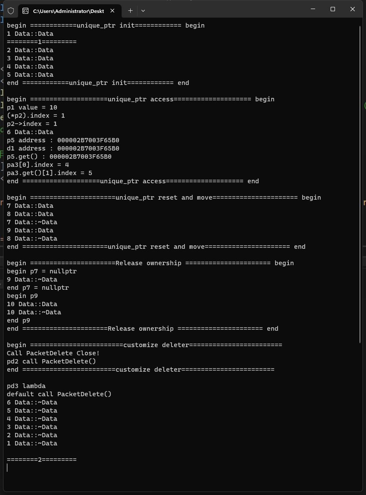

# 智能指针

# 1. `unique_ptr`

## 1.1 基本知识

>- 管理单个对象 (例如以 `new` 分配)
>- 管理动态分配的对象数组 (例如以 `new[]` 分配)
>- 类满足可移动构造 ( Move_Constructible ) 和可移动赋值 ( Move_Assignable ) 的要求
>- 但不满足可复制构造 ( Copy_Constructible ) 或可复制赋值 ( Copy_Assignable ) 的要求。

## 1.2 代码实验

[[参考代码]](/code/106unique_ptr)

>```c++
>#include <iostream>
>
>using namespace std;
>
>class Data
>{
>public:
>	static int count;
>	int index{};
>	Data() {
>		index = ++count;
>		cout << index << ' ' << __FUNCTION__ << '\n';
>	}
>	~Data() {
>		cout << index << ' ' << __FUNCTION__ << '\n';
>	}
>};
>
>int Data::count{};
>
>static void _unique_ptr_()
>{
>	/*RAII 资源获取即初始化 (Resource Acquisition Is Initialization)*/
>	{
>		cout << "begin ============unique_ptr init============ begin\n";
>		unique_ptr<int> p1(new int);
>		unique_ptr<Data> p2(new Data);
>		cout << "========1=========\n";
>		auto p3{ make_unique<Data>() };
>
>		/*空智能指针*/
>		unique_ptr<Data> p4;
>		unique_ptr<int[]> pa1{ make_unique<int[]>(1024) };
>		unique_ptr<int[]> pa2(new int[1024]);
>		unique_ptr<Data[]> pa3(new Data[3]);
>		cout << "end ============unique_ptr init============ end\n\n";
>
>		/*unique_ptr智能指针访问和移动构造赋值*/
>		cout << "begin ====================unique_ptr access==================== begin\n";
>		*p1 = 10;
>		cout << "p1 value = " << *p1 << '\n';
>		cout << "(*p2).index = " << (*p2).index << '\n';
>		cout << "p2->index = " << p2->index << '\n';
>		auto d1{ new Data()};
>		unique_ptr<Data> p5(d1);
>		cout << "p5 address : " << p5 << '\n';
>		cout << "d1 address : " << d1 << '\n';
>		cout << "p5.get() : " << p5.get() << '\n';
>		pa2[0] = 1;
>		pa2[1] = 2;
>		cout << "pa3[0].index = " << pa3[1].index << '\n';
>		cout << "pa3.get()[1].index = " << pa3.get()[2].index << '\n';
>		cout << "end ====================unique_ptr access==================== end\n\n";
>
>		/*重置和移动内存资源*/
>		cout << "begin ======================unique_ptr reset and move====================== begin\n";
>
>		unique_ptr<Data> p6(new Data());
>		/*
>			不可拷贝构造和赋值
>
>			unique_ptr(const unique_ptr&)            = delete;
>			unique_ptr& operator=(const unique_ptr&) = delete;
>
>			unique_ptr<Data> p7(p6);
>			p7 = p6;
>		*/
>		/*支持移动构造与移动赋值 p6释放所有权,转移到p7*/
>		unique_ptr<Data> p7(std::move(p6));
>		unique_ptr<Data> p8(new Data());
>		p7 = std::move(p8);
>
>		/*重置空间,原空间清理*/
>		p7.reset(new Data());
>		cout << "end ======================unique_ptr reset and move====================== end\n\n";
>
>		/*释放所有权和自定义空间删除方法*/
>		cout << "begin ======================Release ownership ====================== begin\n";
>		
>		cout << "begin p7 = nullptr\n";
>		p7 = nullptr;/*主动释放*/
>		cout << "end p7 = nullptr\n";
>
>		/*释放所有权,仅仅智能指针把裸指针返回,需手动释放,尽量避免*/
>
>		cout << "begin p9 \n";
>		unique_ptr<Data> p9(new Data());
>		auto ptr9{ p9.release() };
>		delete ptr9;
>		cout << "end p9 \n";
>		
>		cout << "end ======================Release ownership ====================== end\n\n";
>
>		/*自定义删除方法*/
>		cout << "begin ========================customize deleter========================\n";
>
>		struct XPacket {	/*模型不占用内存*/
>			unsigned char* data{};
>			int size{};
>		};
>
>		class PacketDelete { /*模型不占用内存*/
>		public:
>			void Close() {
>				cout << "Call PacketDelete Close!\n";
>			}
>			/*此处参数str用于实验区分,没有任何意义*/
>			void operator()(XPacket* p,const char* str = "default") const {
>				cout << str << " call PacketDelete()\n";
>				delete p->data;
>				delete p;
>			}
>		};
>
>		unique_ptr<XPacket, PacketDelete> pd1(new XPacket);
>		unique_ptr<XPacket, PacketDelete> pd2(new XPacket);
>		pd2.get_deleter().Close();/*此种可以在某些特殊需要,在释放前做些预处理*/
>		pd2.get_deleter()(pd2.get() /*pd2.operator->()*/ , "pd2"); /* operator->() == get() */
>		pd2.release();
>		//pd2.get_deleter()(pd2.release(),"pd2");	/*此种方法可行,同上*/
>
>		/*lambda 作为删除器*/
>		auto f { [](XPacket* p) {cout << "pd3 lambda\n"; delete p; } };
>		unique_ptr< XPacket, decltype(f) > pd3 (new XPacket,f); 
>
>		cout << "end ========================customize deleter========================\n\n";
>	}
>	
>	cout << "\n========2=========\n";
>}
>
>int main(int argc, char** argv[])
>{
>	_unique_ptr_();
>	(void)getchar();
>	return 0;
>}
>
>```

 
