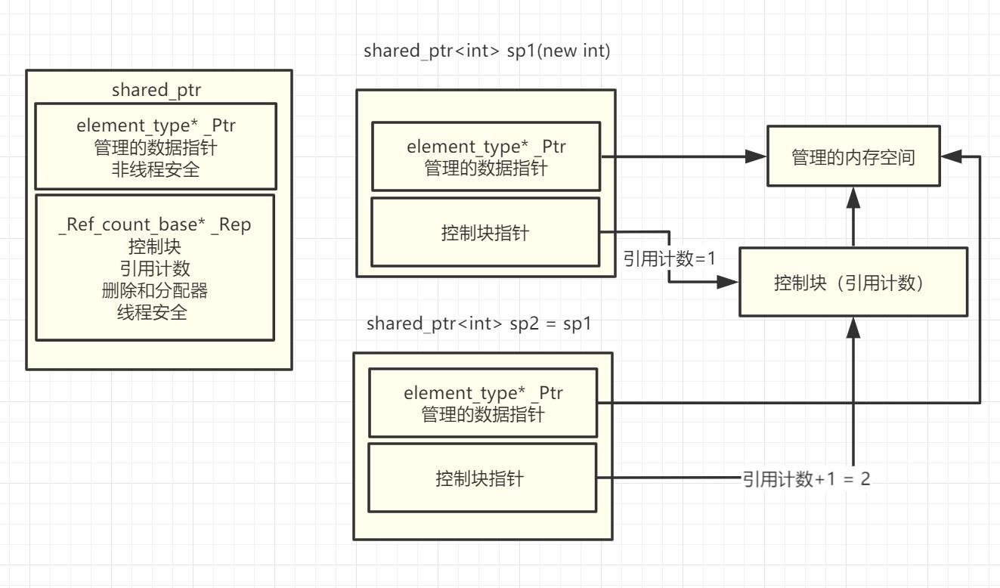

# 3-`shared_ptr` 共享智能指针

# 1.基本知识

>- 共享所有权的智能指针,多个 `shared_ptr` 指向同一对象
>- 可复制构造 (Copy_Constructible)
>- 可复制赋值 (Copy_Assignable)
>- 数据访问非线程安全
>- `shared_ptr` 的控制块是线程安全
>
>

# 2.代码实验

[[参考代码]](https://github.com/WONGZEONJYU/cpp_memory_pool_note/tree/main/code/107shared_ptr)

>```c++
>
>```
>
>