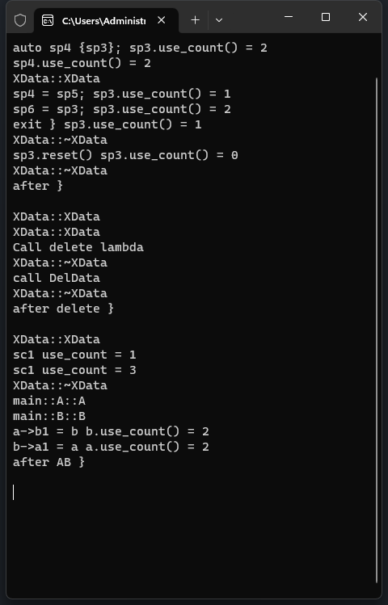

# 3-`shared_ptr` 共享智能指针

# 1.基本知识

>- 共享所有权的智能指针,多个 `shared_ptr` 指向同一对象
>- 可复制构造 (Copy_Constructible)
>- 可复制赋值 (Copy_Assignable)
>- 数据访问非线程安全
>- `shared_ptr` 的控制块是线程安全

 

# 2.代码实验

[[参考代码]](https://github.com/WONGZEONJYU/cpp_memory_pool_note/tree/main/code/107shared_ptr)

>```c++
>#include <iostream>
>#include <memory>
>
>using namespace std;
>
>class XData
>{
>public:
>	XData() {
>		cout << __FUNCTION__ << '\n';
>	}
>	~XData() {
>		cout << __FUNCTION__ << '\n';
>	}
>	int index1{}, index2{};
>};
>
>void DelData(XData* p)
>{
>	cout << "call " << __FUNCTION__ << '\n';
>	delete p;
>}
>
>int main(int argc, char* argv[])
>{
>	{
>		/*1.初始化*/
>		shared_ptr<int> sp1(new int);
>		shared_ptr<int[]> sp2(new int[1024]);
>		*sp1 = 10;
>		sp2[0] = 100;
>		auto d1{ sp1.get() /*sp1.operator->()*/ };/*获取裸指针*/
>
>		//auto d2{ sp2 .operator->() }; /*operator->()该函数模板在int[]类型的情况下没有实例化*/
>
>		auto sp3{ make_shared<XData>() };
>		cout << "sp3.use_count() = " << sp3.use_count() << '\n';
>
>		/*2.可复制构造与赋值*/
>		auto sp4{ sp3 };
>		cout << "auto sp4 {sp3}; sp3.use_count() = " << sp3.use_count() << '\n';/*2*/
>		cout << "sp4.use_count() = " << sp4.use_count() << '\n';/*2*/
>		auto sp5{ make_shared<XData>() };
>		sp4 = sp5;
>		cout << "sp4 = sp5; sp3.use_count() = " << sp3.use_count() << '\n';/*1*/
>
>		{
>			auto sp6 { sp3 };
>			cout << "sp6 = sp3; sp3.use_count() = " << sp3.use_count() << '\n';/*2*/
>		}
>
>		cout << "exit } sp3.use_count() = " << sp3.use_count() << '\n';/*1*/
>		sp3.reset(); /* -1:减一 如果引用计数为 0 则 , 清理空间 */
>		cout << "sp3.reset() sp3.use_count() = " << sp3.use_count() << '\n';/*0*/
>	}
>
>	cout << "after }\n\n";
>
>	/*3 shared_ptr定制删除函数*/
>	{
>		shared_ptr<XData> sp7(new XData, DelData);
>		shared_ptr<XData> sp8(new XData(), [](auto* p) {
>			cout << "Call delete lambda\n";
>			delete p;
>		});
>	}
>	cout << "after delete }\n\n";
>
>	/*4 shared_ptr 智能指针指向同一个对象不同的成员*/
>	{
>		shared_ptr<XData> sc1(new XData);
>		cout << "sc1 use_count = " << sc1.use_count() << '\n';
>
>		shared_ptr<int> sc2(sc1, &sc1->index2);
>		shared_ptr<int> sc3(sc1, &sc1->index1);
>
>		cout << "sc1 use_count = " << sc1.use_count() << '\n';
>	}
>
>	/*5 shared_ptr 循环引用问题原理*/
>	{
>		class B;
>		class A {
>			public:
>				A() { cout << __FUNCTION__ << '\n'; }
>				~A() { cout << __FUNCTION__ << '\n'; }
>				shared_ptr<B> b1;
>		};
>
>		class B {
>			public:
>				B() { cout << __FUNCTION__ << '\n'; }
>				~B() { cout << __FUNCTION__ << '\n'; }
>				shared_ptr<A> a1;
>		};
>
>		auto a{ make_shared<A>() };	/*=1 */
>		auto b{ make_shared<B>() };	/*=1 */
>		a->b1 = b;/*+1 =2 */
>		cout << "a->b1 = b b.use_count() = " << b.use_count() << '\n';
>		b->a1 = a;/*+1 =2 */
>		cout << "b->a1 = a a.use_count() = " << a.use_count() << '\n';
>		/*
>			a 出作用域 a.use_count() - 1 = 1 a资源不释放 , a.b1不释放
>			b.use_count = 2
>
>			b 出作用域 b.use_count() - 1 = 1 b资源不释放 , b.a1不释放
>			b.use_count() = 1 a.use_count() = 1
>		*/
>	}
>	cout << "after AB }\n\n";
>
>	(void)getchar();
>	return 0;
>}
>
>```

 
