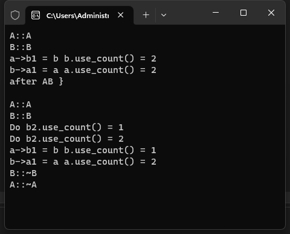

# 4-weak_ptr 

# 1.基本知识

>use_count 返回管理该对象的 shared_ptr 对象数量 expired 检查被引用的对象是否已删除 lock 创建管理被
>引用的对象的 shared_ptr

# 2.实验代码

[[参考代码]](https://github.com/WONGZEONJYU/cpp_memory_pool_note/tree/main/code/108weak_ptr)

>```c++
>#include <iostream>
>#include <memory>
>
>/*
> weak_ptr
>	use_count
>		返回管理该对象的shared_ptr对象数量
>	lock
>		创建管理被引用的对象的shared_ptr
>*/
>
>using namespace std;
>
>class XData
>{
>public:
>	XData() { cout << __FUNCTION__ << '\n'; }
>	~XData(){ cout << __FUNCTION__ << '\n'; }
>
>};
>
>class B;
>class A
>{
>public:
>	A() { cout << __FUNCTION__ << '\n'; }
>	~A() { cout << __FUNCTION__ << '\n'; }
>	void Do() {
>		cout << "Do b2.use_count() = " << b2.use_count() << '\n';
>		auto b{ b2.lock() }; /*复制一个共享智能指针 引用+1*/
>		cout << "Do b2.use_count() = " << b2.use_count() << '\n';
>		/*离开当前作用域,b2.use_count() -1 = 1*/
>	}
>	shared_ptr<B> b1;
>	weak_ptr<B> b2;
>};
>
>class B
>{
>public:
>	B() { cout << __FUNCTION__ << '\n'; }
>	~B() { cout << __FUNCTION__ << '\n'; }
>	shared_ptr<A> a1;
>};
>
>int main(int argc, char* argv[])
>{
>	{
>		auto a{ make_shared<A>() };	/*=1 */
>		auto b{ make_shared<B>() };	/*=1 */
>		a->b1 = b;	/*+1 =2 */
>		cout << "a->b1 = b b.use_count() = " << b.use_count() << '\n';
>		b->a1 = a;	/*+1 =2 */
>		cout << "b->a1 = a a.use_count() = " << a.use_count() << '\n';
>		/*
>			a 出作用域 a.use_count() - 1 = 1 a资源不释放 , a.b1不释放
>			b.use_count = 2
>
>			b 出作用域 b.use_count() - 1 = 1 b资源不释放 , b.a1不释放
>			b.use_count() = 1 a.use_count() = 1
>		*/
>	}
>
>	cout << "after AB }\n\n";
>
>	{
>		auto a{ make_shared<A>() };	/*=1 */
>		auto b{ make_shared<B>() };	/*=1 */
>		a->b2 = b;	/*=1*/
>		a->Do();
>		cout << "a->b1 = b b.use_count() = " << b.use_count() << '\n';
>		b->a1 = a;	/*+1 =2 */
>		cout << "b->a1 = a a.use_count() = " << a.use_count() << '\n';
>	}
>
>	(void)getchar();
>	return 0;
>}
>
>```
>
>