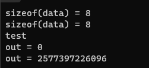

# 5-指针作为函数参数传递-使用模板传递数组

# 1.指针作为参数设计说明

>- 传递输入内存 , 需要提供内存大小 (数组到指针无法知道大小) , 并设置为 `const`
>- 传递输出内存 , 同样需要提供内存大小 , 防止溢出
>- 如果指向函数中创建堆内存 , 需要传递指针引用或者指向指针的指针
>- 通过返回值只能返回堆中空间 , 比较危险 , 需要函数中注释说明 , 防止内存泄漏

# 2.代码实验

[[参考代码]](https://github.com/WONGZEONJYU/cpp_memory_pool_note/tree/main/code/109function_arg_ptr)

>```c++
>#include <iostream>
>#include <memory>
>
>using namespace std;
>
>void PtrFunction(const char* data,int size)
>{
>	cout << "sizeof(data) = " << sizeof(data) << '\n';
>}
>
>/*经过参数传递 数组转换成指针*/
>void PtrFunction(const char data[])
>{
>	cout << "sizeof(data) = " << sizeof(data) << '\n';
>}
>
>/*传递参数 获取数组大小*/
>template<typename Ty,size_t SIZE>
>void TestMen(Ty (&data)[SIZE])
>{
>	cout << "sizeof(data) = " << sizeof(data) << '\n';
>}
>
>/*指针输出*/
>/*
>	1 修改原内存
>	2 使用函数内创建的内存
>*/
>
>char* TestMen()
>{
>	/*不能返回栈中空间*/
>	char buf[1024]{ "test" };
>	return buf;
>}
>
>void TestMen(char* out)
>{
>	/*修改的是局部变量,内存泄露*/
>	out = new char[1024];
>}
>
>/*返回的空间需要注释,由用户释放*/
>int TestMen(char** out)
>{
>	int size{ 1024 };
>	*out = new char[size];
>	return size;
>}
>
>int main(int argc, char* argv[])
>{
>	char data[]{"test mem ptr"};
>
>	PtrFunction(data, sizeof(data));
>	PtrFunction(data);
>	TestMen(data);
>	
>	/*异常空间已经释放 , 结果不确定*/
>	cout << TestMen() << '\n';
>
>	char* out{};
>	TestMen(out);
>
>	cout << "out = " << reinterpret_cast<long long>(out) << '\n';
>	TestMen(&out);
>	cout << "out = " << reinterpret_cast<long long>(out) << '\n';
>	delete[] out;
>	out = nullptr;
>	(void)getchar();
>	return 0;
>}
>
>```

 
