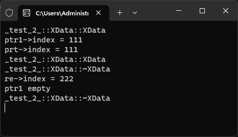

# 6-智能指针作为函数的参数和返回值 `unique_ptr`

# 1.实验代码

[[参考代码]](https://github.com/WONGZEONJYU/cpp_memory_pool_note/tree/main/code/109function_arg_ptr)

>```c++
>namespace _test_2_
>{
>	/*智能指针作为函数参数和返回值*/
>
>	class XData
>	{
>		//XData(const XData&) = delete;
>		//XData& operator=(const XData&) = delete;
>	public:
>		XData() { cout << __FUNCTION__ << '\n'; }
>		~XData() { cout << __FUNCTION__ << '\n'; }
>		int index{};
>	};
>
>	unique_ptr<XData> TestUnique(unique_ptr<XData> ptr)
>	{
>		cout << "prt->index = " << ptr->index << '\n';
>		unique_ptr<XData> re(new XData);
>		re->index = 222;
>		/*编译器优化 1 如果返回值支持move 编译器自动调用move,不支持调用拷贝构造*/
>		return re;
>	}
>
>	void test2()
>	{
>		unique_ptr<XData> ptr1(new XData);
>		ptr1->index = 111;
>
>		cout << "ptr1->index = " << ptr1->index << '\n';
>		auto re{ TestUnique(move(ptr1)) };
>
>		cout << "re->index = " << re->index << '\n';
>
>		if (!ptr1) {
>			cout << "ptr1 empty\n";
>		}
>		else {
>			cout << "ptr1->index = " << ptr1->index << '\n';
>		}
>	}
>}
>```

 
