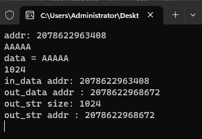

# 7-string作为函数参数内存的输入和输出

# 1.为什么使用string作为函数参数进行输入输出?

>- 不需要考虑内存释放
>- 可以获取已申请内存大小

# 2.代码实验

[[参考代码]](https://github.com/WONGZEONJYU/cpp_memory_pool_note/tree/main/code/110_string_vector_mem)

>```c++
>#include <iostream>
>#include <string>
>#include <vector>
>
>using namespace std;
>
>void TestString(const string& in_data,string& out_data)
>{
>	cout << "data = " << in_data << '\n' <<
>		in_data.size() << '\n' <<
>		"in_data addr: " << reinterpret_cast<long long>(in_data.data()) << '\n';
>
>	out_data.resize(1024);
>	cout << "out_data addr : " << reinterpret_cast<long long>(out_data.data()) << '\n';
>}
>
>int main(int argc, char* argv[])
>{
>	string str1;
>	str1.resize(1024);
>	auto data{ const_cast<char*>(str1.data()) };
>	cout << "addr: " << reinterpret_cast<long long>(data) << '\n';
>	memset(data, 'A', 5);
>	cout <<str1 << '\n';
>	string out_str;
>	TestString(str1, out_str);
>	cout << "out_str size: " << out_str.size() << '\n' <<
>			"out_str addr : " << reinterpret_cast<long long>(out_str.data()) << '\n';
>
>	(void)getchar();
>	return 0;
>}
>
>```
>
>

