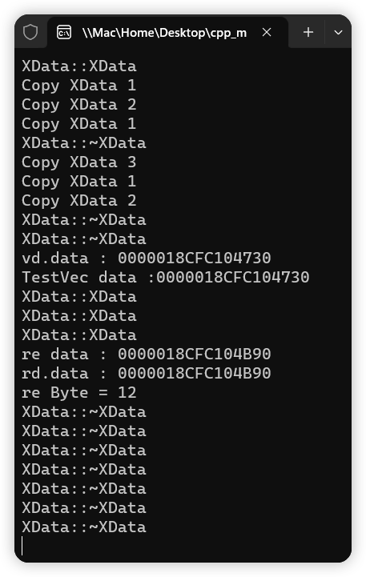

# 8-使用vector传递内存并接收函数返回的内存空间

# 1.优点

>- 功能等同于string
>- 可用传递不同的类型
>- 可以用作返回值支持move

# 2.实验

[[参考代码]](https://github.com/WONGZEONJYU/cpp_memory_pool_note/tree/main/code/111_string_vector_mem)

>```c++
>#include <iostream>
>#include <vector>
>
>using namespace std;
>
>class XData
>{
>public:
>	XData() { cout << __FUNCTION__ << '\n'; }
>	~XData() { cout << __FUNCTION__ << '\n'; }
>
>	XData(const XData& o) {
>		index = o.index;
>		cout << "Copy XData " << index << '\n';
>	}
>
>	XData& operator=(const XData& o) {
>
>		if (this != &o){
>			index = o.index;
>			cout << "=XData " << index << '\n';
>		}
>		return *this;
>	}
>
>	int index{};
>};
>
>vector<XData> TestVec(vector<XData>& data)
>{
>	cout << "TestVec data :" << data.data() << '\n';
>	vector<XData> re;
>	re.resize(3);
>	cout << "re data : " << re.data() << '\n';
>	return re;
>}
>
>int main(int argc, char* argv[])
>{
>	{
>		vector<XData> vd;
>#if 0
>		XData d;
>		d.index = 1;
>		vd.push_back(d);
>		d.index = 2;
>		vd.push_back(d);
>		d.index = 3;
>		vd.push_back(d);
>		cout << "vd.data : " << vd.data() << '\n';
>		auto rd{ TestVec(vd) };
>		cout << "rd.data : " << rd.data() << '\n';
>		cout << "re Byte = " << rd.size() * sizeof(XData) << '\n';
>		//cout << "re cap = " << rd.capacity() << '\n';
>#endif
>	}
>
>	(void)getchar();
>	return 0;
>}
>
>
>```
>
>

