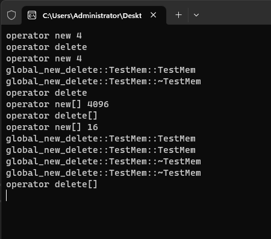
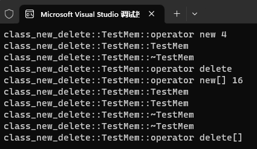
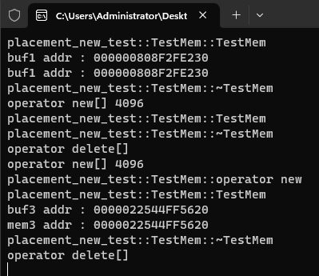

# 9-重载new和delete

# 1. 为什么要重载new与delete

>- 监测内存创建销毁 , 统计和监控泄漏
>- 内存对齐的处理
>- 特定应用 : 例如多进程内存共享

# 2.重载的全局new和delete

[[参考代码]](https://github.com/WONGZEONJYU/cpp_memory_pool_note/tree/main/code/112operator_new)

>```c++
>#include <iostream>
>
>using namespace std;
>
>void* operator new(size_t size)
>{
>	cout << __FUNCTION__ << " " << size << '\n';
>	auto mem{ malloc(size) };
>	if (!mem) {
>		throw std::bad_alloc();
>	}
>	return mem;
>}
>
>void* operator new[](size_t size)
>{
>	cout << __FUNCTION__ << " " << size << '\n';
>	auto mem{ malloc(size) };
>	if (!mem) {
>		throw std::bad_alloc();
>	}
>	return mem;
>}
>
>void operator delete(void* p)
>{
>	cout << __FUNCTION__ << '\n';
>	std::free(p);
>}
>
>void operator delete[](void* p)
>{
>	cout << __FUNCTION__ << '\n';
>	std::free(p);
>}
>
>namespace global_new_delete
>{
>	class TestMem
>	{
>	public:
>		int index{};
>		TestMem() { cout << __FUNCTION__ << '\n'; }
>		~TestMem() { cout << __FUNCTION__ << '\n'; }
>	};
>
>	void test()
>	{
>		int* i1{ new int };
>		delete i1;
>
>		auto mem1{ new TestMem() };
>		delete mem1;
>
>		mem1 = nullptr;
>		i1 = nullptr;
>
>		int* arr1{ new int[1024] };
>		delete[] arr1;
>
>		TestMem* memarr1{ new TestMem[2] };
>		delete[] memarr1;
>	}
>}
>
>int main(int argc, char* argv[])
>{
>	global_new_delete::test();
>	(void)getchar();
>	return 0;
>}
>
>```

 

# 3. 重载类的操作符的new和delete

[[参考代码]](https://github.com/WONGZEONJYU/cpp_memory_pool_note/tree/main/code/112operator_new)

>```c++
>#include <iostream>
>
>using namespace std;
>
>namespace class_new_delete
>{
>	class TestMem
>	{
>	public:
>		int index{};
>		TestMem() { cout << __FUNCTION__ << '\n'; }
>		~TestMem() { cout << __FUNCTION__ << '\n'; }
>		void* operator new(size_t size) {
>			cout << __FUNCTION__ << " " << size << '\n';
>			auto mem{ malloc(size) };
>			if (!mem) {
>				throw std::bad_alloc();
>			}
>			return mem;
>		}
>		void* operator new[](size_t size)
>		{
>				cout << __FUNCTION__ << " " << size << '\n';
>				auto mem{ malloc(size) };
>				if (!mem) {
>					throw std::bad_alloc();
>				}
>				return mem;
>		}
>
>		void operator delete(void* p)
>		{
>			cout << __FUNCTION__ << '\n';
>			std::free(p);
>		}
>
>		void operator delete[](void* p)
>		{
>			cout << __FUNCTION__ << '\n';
>			std::free(p);
>		}
>	};
>
>	void test()
>	{
>		auto mem1{ new TestMem() };
>		delete mem1;
>		mem1 = nullptr;
>
>		TestMem* memarr1{ new TestMem[2] };
>		delete[] memarr1; 
>		memarr1 = nullptr;
>	}
>}
>
>int main(int argc, char* argv[])
>{
>	//global_new_delete::test();
>	class_new_delete::test();
>	(void)getchar();
>	return 0;
>}
>```

 

# 4. 放置 placement new 和 delete,new 的空间指向已有的地址中 

>- 普通 new 申请空间是从堆中分配空间 , 一些特殊的需求要在已分配的空间中创建对象 , 就可以使用放置
>  `placement new` 操作
>- `placement new` 生成对象既可以在栈上，也可以在堆上
>- `placement new` 生成对象销毁要 **手动调用析构函数**

## 4.1 代码

[[参考代码]](https://github.com/WONGZEONJYU/cpp_memory_pool_note/tree/main/code/112operator_new)

>```c++
>#include <iostream>
>
>using namespace std;
>
>namespace placement_new_test
>{
>	class TestMem
>	{
>	public:
>		int index{};
>		TestMem() { cout << __FUNCTION__ << '\n'; }
>		~TestMem() { cout << __FUNCTION__ << '\n'; }
>
>		void* operator new(size_t size) {
>			cout << __FUNCTION__ << " " << size << '\n';
>			auto mem{ malloc(size) };
>			if (!mem) {
>				throw std::bad_alloc();
>			}
>			return mem;
>		}
>
>		void* operator new[](size_t size)
>		{
>				cout << __FUNCTION__ << " " << size << '\n';
>				auto mem{ malloc(size) };
>				if (!mem) {
>					throw std::bad_alloc();
>				}
>				return mem;
>		}
>
>		void* operator new(size_t size, void* ptr) noexcept
>		{
>			cout << __FUNCTION__ << '\n';
>			return ptr;
>		}
>
>		void operator delete(void* p)
>		{
>			cout << __FUNCTION__ << '\n';
>			std::free(p);
>		}
>
>		void operator delete[](void* p)
>		{
>			cout << __FUNCTION__ << '\n';
>			std::free(p);
>		}
>	};
>
>	void test()
>	{
>		int buf1[1024]{};
>		TestMem* mem1{ ::new(buf1) TestMem() };
>		cout << "buf1 addr : " << buf1 << '\n'
>			<< "buf1 addr : " << mem1 << "\n";
>		mem1->~TestMem();
>
>		int* buf2{ new int[1024] {} };
>		auto mem2{ ::new(buf2) TestMem() };
>		mem2->~TestMem();
>		::delete[] buf2;
>		buf2 = nullptr;
>
>		int* buf3{ new int[1024] {} };
>		auto mem3{ new(buf3) TestMem };
>		cout << "buf3 addr : " << buf3 << '\n'
>		 << "mem3 addr : " << mem3 << "\n";
>		mem3->~TestMem();
>		::delete[] buf3;
>		buf3 = nullptr;
>	}
>}
>
>int main(int argc, char* argv[])
>{
>	//global_new_delete::test();
>	//class_new_delete::test();
>	placement_new_test::test();
>	(void)getchar();
>
>	return 0;
>}
>
>```

 
